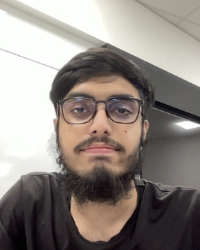
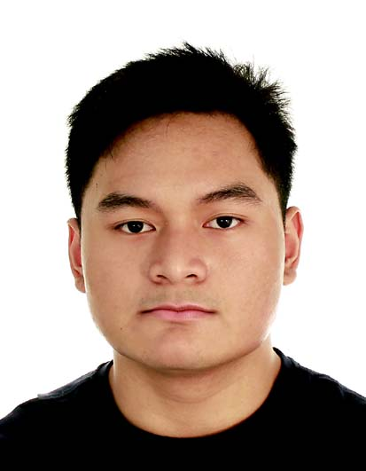
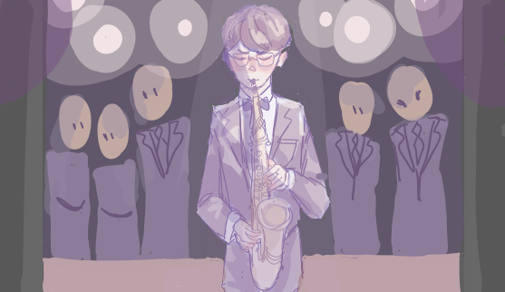

We are a team based in the [School of Computing, National University of Singapore](http://www.comp.nus.edu.sg).

You can reach us at the email `chandan_ab@u.nus.edu`

## Project team

### Anton Tan Hong Zhi

[[github](https://github.com/antonTan96)]
[[portfolio](team/antontan96.md)]

* Role: Developer
* Responsibilities:
  * Co-ordinate product design

### Aslam

[[github](http://github.com/aslam341)]
[[portfolio](team/aslam341.md)]

* Role: Developer
* Responsibilities:
  * Ensure code quality, standard and correctness

### Chandan

[[github](http://github.com/Chandan8186)] 
[[portfolio](team/chandan8186.md)]

* Role: Developer
* Responsibilities: 
  * Manage and verify product releases

### Rayyan Ismail

[[github](http://github.com/rayyan35p)]
[[portfolio](team/rayyan35p.md)]

* Role: Developer
* Responsibilities:
  * Ensure team meets deadlines for deliverables

### Timothy Leow

[[github](http://github.com/timleow)]
[[portfolio](team/timleow.md)]

* Role: Developer
* Responsibilities:
  * Manage bug triaging

