* Table of Contents
{:toc}

--------------------------------------------------------------------------------------------------------------------

## **Acknowledgements**

* {list here sources of all reused/adapted ideas, code, documentation, and third-party libraries -- include links to the original source as well}

--------------------------------------------------------------------------------------------------------------------

## **Setting up, getting started**

Refer to the guide [_Setting up and getting started_](SettingUp.md).

--------------------------------------------------------------------------------------------------------------------

## **Design**

<div markdown="span" class="alert alert-primary">

:bulb: **Tip:** The `.puml` files used to create diagrams in this document `docs/diagrams` folder. Refer to the [_PlantUML Tutorial_ at se-edu/guides](https://se-education.org/guides/tutorials/plantUml.html) to learn how to create and edit diagrams.
</div>

### Architecture


The ***Architecture Diagram*** given above explains the high-level design of the App.

Given below is a quick overview of main components and how they interact with each other.

**Main components of the architecture**

**`Main`** (consisting of classes [`Main`](https://github.com/AY2324S1-CS2103T-T08-3/tp/blob/master/src/main/java/seedu/address/Main.java) and [`MainApp`](https://github.com/AY2324S1-CS2103T-T08-3/tp/blob/master/src/main/java/seedu/address/MainApp.java)) is in charge of the app launch and shut down.
* At app launch, it initializes the other components in the correct sequence, and connects them up with each other.
* At shut down, it shuts down the other components and invokes cleanup methods where necessary.

The bulk of the app's work is done by the following four components:

* [**`UI`**](#ui-component): The UI of the App.
* [**`Logic`**](#logic-component): The command executor.
* [**`Model`**](#model-component): Holds the data of the App in memory.
* [**`Storage`**](#storage-component): Reads data from, and writes data to, the hard disk.

[**`Commons`**](#common-classes) represents a collection of classes used by multiple other components.

**How the architecture components interact with each other**

The *Sequence Diagram* below shows how the components interact with each other for the scenario where the user issues the command `deleteE 1`.

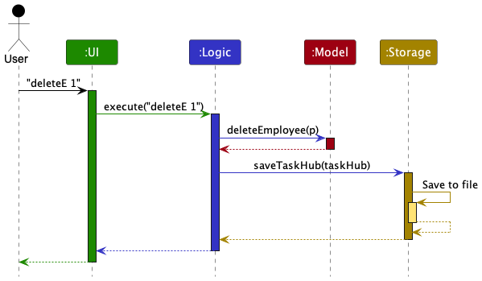

Each of the four main components (also shown in the diagram above),

* defines its *API* in an `interface` with the same name as the Component.
* implements its functionality using a concrete `{Component Name}Manager` class (which follows the corresponding API `interface` mentioned in the previous point).

For example, the `Logic` component defines its API in the `Logic.java` interface and implements its functionality using the `LogicManager.java` class which follows the `Logic` interface. Other components interact with a given component through its interface rather than the concrete class (reason: to prevent outside component's being coupled to the implementation of a component), as illustrated in the (partial) class diagram below.


The sections below give more details of each component.

### UI component

The **API** of this component is specified in [`Ui.java`](https://github.com/AY2324S1-CS2103T-T08-3/tp/blob/master/src/main/java/seedu/address/ui/Ui.java)

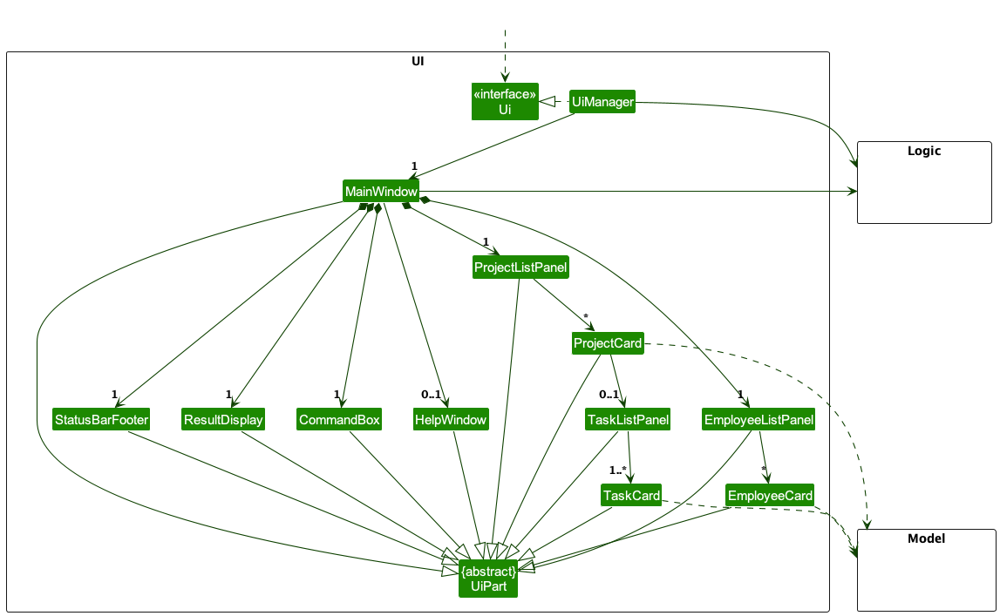

The UI consists of a `MainWindow` that is made up of parts e.g.`CommandBox`, `ResultDisplay`, `EmployeeListPanel`, `ProjectListPanel`, `StatusBarFooter` etc. All these, including the `MainWindow`, inherit from the abstract `UiPart` class which captures the commonalities between classes that represent parts of the visible GUI.

The `UI` component uses the JavaFx UI framework. The layout of these UI parts are defined in matching `.fxml` files that are in the `src/main/resources/view` folder. For example, the layout of the [`MainWindow`](https://github.com/AY2324S1-CS2103T-T08-3/tp/blob/master/src/main/java/seedu/address/ui/MainWindow.java) is specified in [`MainWindow.fxml`](https://github.com/AY2324S1-CS2103T-T08-3/tp/blob/master/src/main/resources/view/MainWindow.fxml)

The diagram above briefly demonstrates the hierarchy of the Ui components. A few more notes are as follows:
* At the level just below `MainWindow`, there are the main components, like `CommandBox`, `ResultDisplay`, `EmployeeListPanel` and `ProjectListPanel`.
* `EmployeeListPanel` contains some number of `EmployeeCard`s.
* `ProjectListPanel` contains some number of `ProjectCard`s 
  * which contain a `TaskListPanel` with their `TaskCard`s if the relevant `Project` in the `Model` contains a `Task`.

The `UI` component,

* executes user commands using the `Logic` component.
* listens for changes to `Model` data so that the UI can be updated with the modified data.
* keeps a reference to the `Logic` component, because the `UI` relies on the `Logic` to execute commands.
* depends on some classes in the `Model` component, as it displays `Employee` object residing in the `Model`.

### Logic component

**API** : [`Logic.java`](https://github.com/AY2324S1-CS2103T-T08-3/tp/blob/master/src/main/java/seedu/address/logic/Logic.java)

Here's a (partial) class diagram of the `Logic` component:

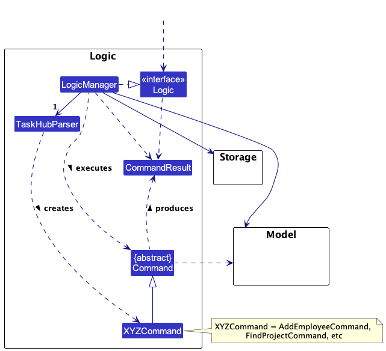

The sequence diagram below illustrates the interactions within the `Logic` component, taking `execute("deleteE 1")` API call as an example.


<div markdown="span" class="alert alert-info">:information_source: **Note:** The lifeline for `DeleteEmployeeCommandParser` should end at the destroy marker (X) but due to a limitation of PlantUML, the lifeline reaches the end of diagram.
</div>

How the `Logic` component works:

1. When `Logic` is called upon to execute a command, it is passed to a `TaskHubParser` object which in turn creates a parser that matches the command (e.g., `DeleteEmployeeCommandParser`) and uses it to parse the command.
2. This results in a `Command` object (more precisely, an object of one of its subclasses e.g., `DeleteEmployeeCommand`) which is executed by the `LogicManager`.
3. The command can communicate with the `Model` when it is executed (e.g. to delete a employee).
4. The result of the command execution is encapsulated as a `CommandResult` object which is returned back from `Logic`.

Here are the other classes in `Logic` (omitted from the class diagram above) that are used for parsing a user command:

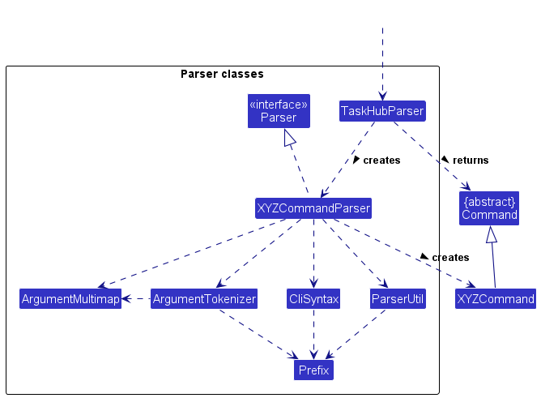

How the parsing works:
* When called upon to parse a user command, the `TaskHubParser` class creates an `XYZCommandParser` (`XYZ` is a placeholder for the specific command name e.g., `AddEmployeeCommandParser`) which uses the other classes shown above to parse the user command and create a `XYZCommand` object (e.g., `AddEmployeeCommand`) which the `TaskHubParser` returns back as a `Command` object.
* All `XYZCommandParser` classes (e.g., `AddEmployeeCommandParser`, `DeleteEmployeeCommandParser`, ...) inherit from the `Parser` interface so that they can be treated similarly where possible e.g, during testing.

### Model component
**API** : [`Model.java`](https://github.com/AY2324S1-CS2103T-T08-3/tp/blob/master/src/main/java/seedu/address/model/Model.java)

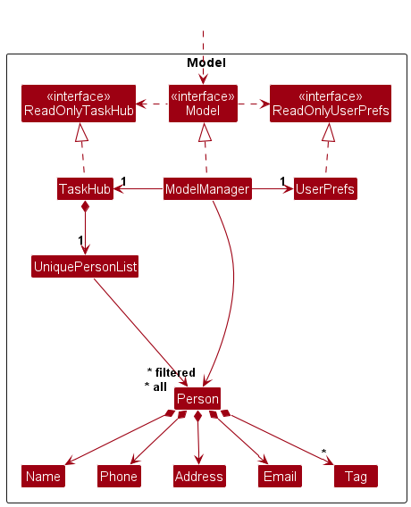


The `Model` component,

* stores the TaskHub data i.e., all `Employee` and `Project` objects, which are separately contained in a `UniqueEmployeeList` object and a `UniqueProjectList` object. `Task` objects exist within the `TaskList` of a `Project`.
* stores the currently 'selected' `Employee` and `Project` objects (e.g., results of a search query) as 2 separate _filtered_ lists which are exposed to outsiders as unmodifiable `ObservableList<Employee>` and `ObservableList<Project>` that can be 'observed' e.g. the UI can be bound to this list so that the UI automatically updates when the data in the list change.
* stores a `UserPref` object that represents the user’s preferences. This is exposed to the outside as a `ReadOnlyUserPref` object.
* does not depend on any of the other three components (as the `Model` represents data entities of the domain, they should make sense on their own without depending on other components)

<div markdown="span" class="alert alert-info">

:information_source: **Note:** The focus of the above class diagram is on the `Employee`, `Project`, `Task` classes as well as the relevant lists that contain them. More details will be provided in subsequent sections.

</div>


### Employee component
**API** : [`Employee.java`](https://github.com/AY2324S1-CS2103T-T08-3/tp/blob/master/src/main/java/seedu/address/model/employee/Employee.java)

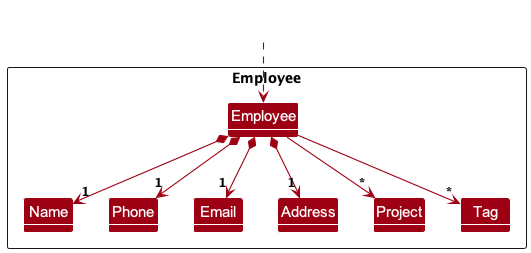

The `Employee` component stores an employee's data which comprises:

* a `Name`, `Phone`, `Email`, `Address` and `Tag`(s).
* `Tag`(s) are optional.


### Project component
**API** : [`Project.java`](https://github.com/AY2324S1-CS2103T-T08-3/tp/blob/master/src/main/java/seedu/address/model/project/Project.java)

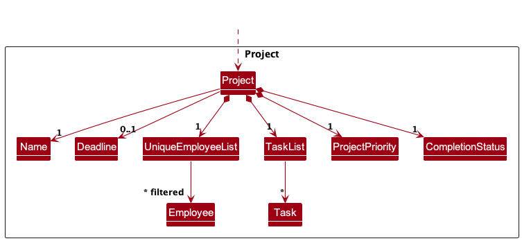

The `Project` component stores a project's data which comprises:

* a `Name`, `Deadline`, `UniqueEmployeeList`, `TaskList`, `Priority` and `CompletionStatus`.
* The `Deadline` is optional.
* The `UniqueEmployeeList` contains only the `Employee`s under the said `Project`.
* Each `Employee` in the `UniqueEmployeeList` of the project must also exist in the `UniqueEmployeeList` of the `Model`. (All fields must be the same) 
* The `TaskList` contains the `Task`s which have been added to the `Project`.
* The `Employee` (if applicable) in each `Task` in the `TaskList` of the project must also exist in the `UniqueEmployeeList` of the project.

***Note: For the Model, Employee and Project components, lower-level details (e.g. most class attributes and methods) have been omitted for visual clarity.


### Task component
**API** : [`Task.java`](https://github.com/AY2324S1-CS2103T-T08-3/tp/blob/master/src/main/java/seedu/address/model/task/Task.java)

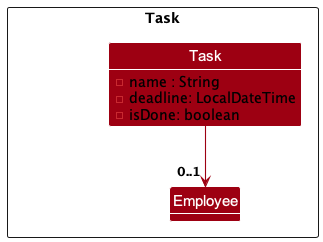

The `Task` component stores a task's data which comprises:

* a `name`, `deadline`, `Employee`, and `isDone` field.
* The `Employee` is optional - a Task may be assigned to an `Employee` within the `Project` or not.


<div markdown="span" class="alert alert-info">

:information_source: **Note:** The `Employee`, `Project` and `Task` class diagrams above have omitted some details (e.g. class methods) to improve visual clarity. Only the most important fields and associations are shown.

</div>

### Storage component

**API** : [`Storage.java`](https://github.com/AY2324S1-CS2103T-T08-3/tp/blob/master/src/main/java/seedu/address/storage/Storage.java)

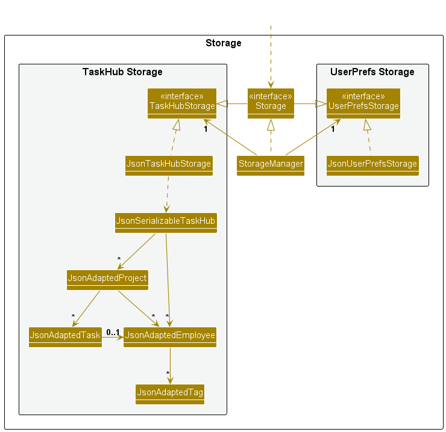

The `Storage` component,
* can save both TaskHub data and user preference data in JSON format, and read them back into corresponding objects.
* inherits from both `TaskHubStorage` and `UserPrefStorage`, which means it can be treated as either one (if only the functionality of only one is needed).
* depends on some classes in the `Model` component (because the `Storage` component's job is to save/retrieve objects that belong to the `Model`)

### Common classes

Classes used by multiple components are in the `seedu.address.commons` package.

--------------------------------------------------------------------------------------------------------------------

## **Implementation**

This section describes some noteworthy details on how certain features are implemented.

### Upgraded help feature 
In the `initialize()` method of the `HelpWindow` class, commands are organized into different categories using HashMaps. Here's an explanation:

```java
// Initializes LinkedHashMaps to store commands for different sections
Map<String, String> generalCommands = new LinkedHashMap<>();
Map<String, String> employeeCommands = new LinkedHashMap<>();
Map<String, String> projectCommands = new LinkedHashMap<>();
Map<String, String> taskCommands = new LinkedHashMap<>();
Map<String, String> assignmentCommands = new LinkedHashMap<>();
```
The command formats with short descriptions accompanying them are then inserted into each `LinkedHashMap` accordingly.
The keys in the LinkedHashMap represent the command formats, while the corresponding values provide a description of what each command does.

```java
// Adds sections and their respective commands to the VBox layout
addToVBox("General Commands", generalCommands);
addToVBox("Employee Commands", employeeCommands);
addToVBox("Project Commands", projectCommands);
addToVBox("Task Commands", taskCommands);
addToVBox("Assignment Commands", assignmentCommands);
```

The `addToVBox()` method takes a section header (like "General Commands") and a corresponding HashMap of commands. It then formats and adds these commands to the `VBox` layout of the help window.

This code structure efficiently organizes commands into distinct sections, making it easier for users to locate and understand the functionalities provided by each command. It also promotes code readability and maintainability for developers working on the application.

An alternative imeplementation of `HelpWindow` could be to store each command format and description in a centralized database, and retrieve the data from there to be displayed in the HelpWindow, rather than to have to modify the code in `HelpWindow` separately when there is a change in the formats/descriptions.


### Add Project feature

When creating a new project from the `addP` command, each `Employee` that is to be added to the `Project` is updated to have an empty `Project`. This is to avoid cyclic dependency between an `Employee` and a `Project`.

Given below is an example usage scenario and the internal changes that happen at each step.

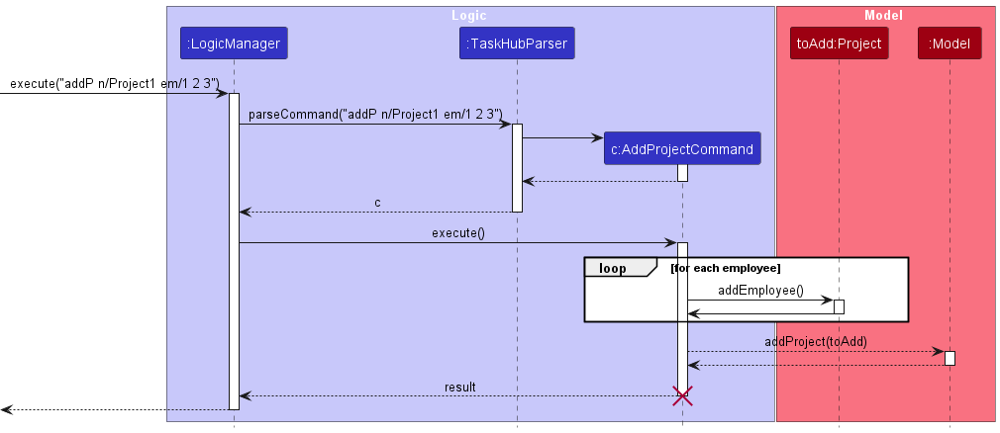

Step 1. The user launches the application. All employees and projects will be shown to the user.

Step 2. The user executes `addP n/Project1 em/1 2 3` to add a new `Project` called `Project1` with the 1<sup>st</sup>, 2<sup>nd</sup> and 3<sup>rd</sup> `Employee` on the list as a member. `LogicManager` will call `TaskHubParser#parse(input)` to extract the parameters and pass it to an `AddProjectCommandParser`.

Step 3. `TaskHubParser` will call `AddProjectCommandParser#parse(arguments)` to produce a `AddProjectCommand` to be executed by the `LogicManager`.

Step 4. `LogicManager` calls `AddProjectCommand#execute(model)` to produce a `CommandResult `to be logged. 

Step 5. During the execution of the `AddProjectCommand`, selected `Employee`s are extracted from the current `UniqueEmployeeList` of `TaskHub` and added to the `Project` in the `AddProjectCommand`. New copies of `Employee` objects are also created to replace the original `Employee` objects in the UniqueEmployeeList using a new `EditCommand`.  

Step 6. A `CommandResult` is produced based on whether the execution was a success or not and returned to the `LogicManager`. 

### Prioritise Projects Feature

A priority can be assigned to multiple projects using the `priorityP` command. 

This command modifies the `Priority` attribute of a `Project` by creating a new `Project` with the updated `Priority` and replacing the existing project with the updated one.

Given below is an example usage scenario and the internal changes that happen at each step.

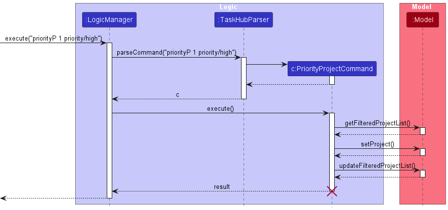

Step 1. The user launches the application. All employees and projects will be shown to the user.

Step 2. The user executes `priorityP 1 2 3 p/high` to assign a high priority to the projects indexed at 1, 2 and 3. `LogicManager` will call `TaskHubParser#parse(input)` to extract the parameters and pass it to a `PriorityProjectCommandParser`.

Step 3. `TaskHubParser` will call `PriorityProjectCommandParser#parse(arguments)` to produce a `PriorityProjectCommand` to be executed by the `LogicManager`.

Step 4. `LogicManager` calls `PriorityProjectCommand#execute(model)` to produce a `CommandResult`.

Step 5. During the execution of the `PriorityProjectCommand`, new projects are created with the same details as the projects whose `Priority` is supposed to be changed, except that the `Priority` for all the projects are now high.

Step 6. The model is updated accordingly through `ModelManager` by replacing the old projects with the new projects with the updated `Priority`.

Step 7. A `CommandResult` is produced based on whether the execution was a success or not and returned to the `LogicManager`.

### Find Projects Feature

The displayed list of `Project`s can be filtered by name (specifically, the keywords that the project name contains).

The `findP` command accepts a sequence of keywords (at least 1) and filters the displayed `Project`s accordingly.

Once the `Project`s are filtered out, the displayed list of `Employee`s will also be filtered out, according to whether
they are under at least one of the said filtered `Project`s.

Given below is an example usage scenario and the internal changes that happen at each step.

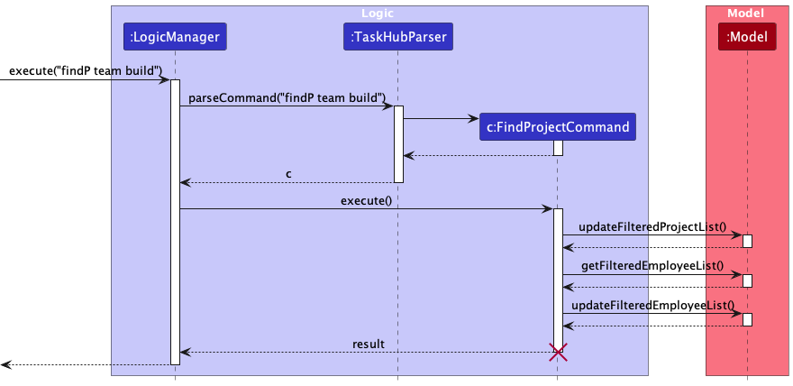

Step 1. The user launches the application. All employees and projects will be shown to the user.

Step 2. The user executes the `findP website presentation` command to search for projects with name containing "website" and/or "presentation".
`LogicManager` will call `TaskHubParser#parse(input)` to extract the parameters and pass it to an `FindProjectCommandParser`.

Step 3. `TaskHubParser` will call `FindProjectCommandParser#parse(arguments)` to produce a `FindProjectCommand` to be executed by the `LogicManager`.

Step 4. `LogicManager` calls `FindProjectCommand#execute(model)` to produce a `CommandResult`.

Step 5. During the execution of the `FindProjectCommand`, the `ProjectNameContainsKeywordsPredicate` predicate that is received, is
used to update the model's `FilteredProjectList` through `ModelManager`. 

Step 6. Then, using the updated `FilteredProjectList` from step 5, a new `EmployeeUnderFilteredProjectsPredicate` predicate is created. Using this predicate, 
the model's `FilteredEmployeeList` is updated through `ModelManager`.

Step 7. A `CommandResult` is produced based on whether the execution was a success or not and returned to the `LogicManager`.


### Mark Projects feature

Execution of the `markP` command will result in each `Project` being marked as completed. This is done by setting each `Project`'s `isCompleted` attribute to `true`.

Given below is an example usage scenario and the internal changes that happen at each step.

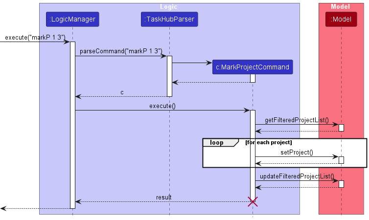

Step 1. The user launches the application. All employees and projects will be shown to the user.

Step 2. The user executes `markP 1 3` to mark the 1st and 3rd `Project` on the shown list as completed. `LogicManager` will call `TaskHubParser#parse(input)` to extract the parameters and pass it to a `MarkProjectParser`.

Step 3. `TaskHubParser` will call `MarkProjectParser#parse(arguments)` to produce a `MarkProjectCommand` to be executed by the `LogicManager`.

Step 4. `LogicManager` calls `MarkProjectCommand#execute(model)` to produce a `CommandResult `to be logged.

Step 5. During the execution of the `MarkProjectCommand`, a new `Project` object is created for each `Project` to be marked as completed. The new `Project` objects are then used to replace the original `Project` objects in the `UniqueProjectList`.

Step 6. A `CommandResult` is produced based on whether the execution was a success or not and returned to the `LogicManager`.

A similar sequence of events will occur when executing the `unmarkP` command, except that the `isCompleted` attribute of each `Project` will be set to `false` instead of `true`.

### Add Task feature
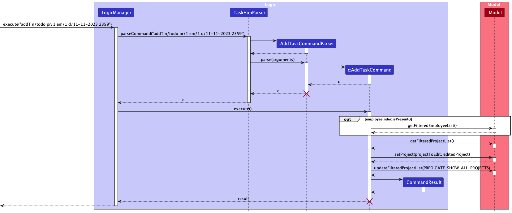


When creating a new task using the `addT` command, the `TaskList` of the specified `Project` is updated, and the `Project` is hence updated too.

Given below is an example usage scenario and the internal changes that happen at each step.

Step 1. The user launches the application. All employees and projects will be shown to the user.

Step 2. The user executes `addT n/todo pr/1 em/1 d/11-11-2023 2359` to add a new `Task` called `todo` to the first currently listed `Project`, assigned to the first `Employee` within that `Project`. `LogicManager` will call `TaskHubParser#parse(input)` to extract the parameters and pass it to an `AddTaskCommandParser`.

Step 3. `TaskHubParser` will call `AddTaskCommandParser#parse(arguments)` to produce a `AddTaskCommand` to be executed by the `LogicManager`.

Step 4. `LogicManager` calls `AddTaskCommand#execute(model)` to produce a `CommandResult `to be logged.

Step 5. During the execution of the `AddTaskCommand`, a new `Project` copy is created, with an updated `TaskList` that contains the newly created `Task`.
If an `employeeIndex` was specified by the command (in this case it was), then `Model::getFilteredEmployeeList` is called to assign the new `Task` to the specified  `Employee`. 
Then, the `Model#setProject` and `Model#updateFilteredProjectList` is called, to trigger a `Ui` update, as the specified `Project` has been updated with an updated `TaskList`.

Step 6. A `CommandResult` is produced based on whether the execution was a success or not and returned to the `LogicManager`.

### Storage Validation

When TaskHub is first loaded, the `taskhub.json` file is checked whether it can be converted into a valid TaskHub model.
This is to prevent undefined behaviour from users making modifications to the `taskhub.json` file.

Given below is an example usage scenario and the internal changes that happen at each step.

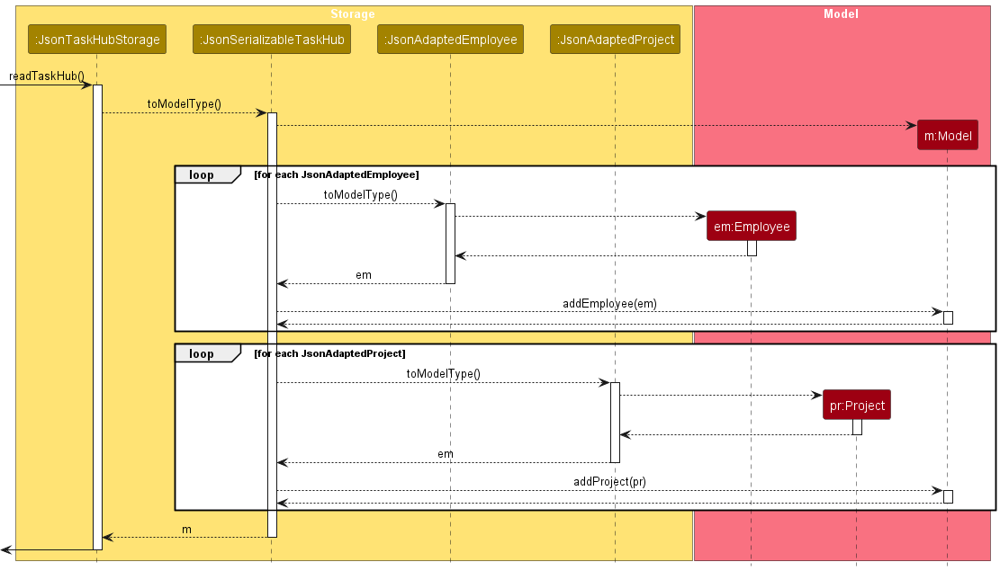

Step 1. The user launches the application.

Step 2. `Main` will look for the data file in the specified `filepath` in the `preferences.json` file and pass it to the `JsonTaskHubStorage`. If there is no file found,
        then a new `TaskHub` with sample data will be created.

Step 3. After retrieving the data file, `JsonTaskHubStorage` will call `JsonSerializableTaskHub` to check whether each `JsonAdaptedEmployee` fulfills the requirements of an `Employee`.
        If the requirements are fulfilled ([Employee Requirements here](#employee-component)), then each `JsonAdaptedEmployee` is converted into an `Employee` and added to a `UniqueEmployeeList`.

Step 4. `JsonSerializableTaskHub` will then check whether each `JsonAdaptedProject` fulfills the requirements of a `Project`.
        If the requirements are fulfilled ([Project Requirements here](#project-component)), then each `JsonAdaptedProject` is converted into a `Project` and added to a `UniqueProjectList`.

If any `JsonAdaptedEmployee` or `JsonAdaptedProject` fails to meet the requirements, an empty `Taskhub` is returned.


--------------------------------------------------------------------------------------------------------------------

## **Documentation, logging, testing, configuration, dev-ops**

* [Documentation guide](Documentation.md)
* [Testing guide](Testing.md)
* [Logging guide](Logging.md)
* [Configuration guide](Configuration.md)
* [DevOps guide](DevOps.md)

--------------------------------------------------------------------------------------------------------------------

## **Appendix: Requirements**

### Product scope

**Target user profile**:

* has a need to manage a significant number of employees in a project management context
* has a need to manage projects with multiple timelines
* has a need to quickly delegate and manage distribution of tasks and projects among employees
* prefer desktop apps over other types
* can type fast
* prefers typing to mouse interactions
* is reasonably comfortable using CLI apps

**Value proposition**: manage projects and task delegation faster than a typical mouse/GUI driven app


### User stories

Priorities: High (must have) - `* * *`, Medium (nice to have) - `* *`, Low (unlikely to have) - `*`

| Priority | As a …​                             | I want to …​                  | So that I can…​                                                          |
|----------|-------------------------------------|-------------------------------|--------------------------------------------------------------------------|
| `* * *`  | completely new user                 | see usage instructions        | refer to instructions when I forget how to use the App                   |
| `* * *`  | user                                | add a new employee            | easily manage and access employees in one place                          |
| `* * *`  | user                                | delete an employee            | remove entries that I no longer need                                     |
| `* * *`  | user                                | edit an employee              | change the details of the employee                                       |
| `* * *`  | user                                | list all employees            | see an overview of all the employees                                     |
| `* * *`  | user                                | add a new project             | easily manage and access projects in one place                           |
| `* * *`  | user                                | delete a project              | remove entries that I no longer need                                     |
| `* * *`  | user                                | edit a project                | change the details of the project                                        |
| `* * *`  | user                                | list all projects             | see an overview of all my projects                                       |
| `* * *`  | user                                | find an employee by name      | locate details of employees without having to go through the entire list |
| `* * *`  | user                                | assign employees to a project | know which employees are on which projects in one place                  |
| `* *`    | completely new user                 | have sample data              | practice some commands before trying the App                             |
| `* *`    | user                                | purge all data                | get rid of sample/experimental data and add in my actual data            |
| `*`      | user with many projects in TaskHub  | sort projects by date         | tell which project deadlines are coming soon                             |
| `*`      | user with many employees in TaskHub | sort employees by name        | locate an employee easily                                                |
| `*`      | new user                            | get autocomplete suggestions  | write commands without referring to usage instructions often             |

*{More to be added}*

### Use cases

(For all use cases below, the **System** is the `TaskHub` and the **Actor** is the `user`, unless specified otherwise)

**Use case 1: Delete a employee**

**MSS**

1.  User requests to list employees
2.  TaskHub shows a list of employees
3.  User requests to delete a specific employee in the list
4.  TaskHub deletes the employee

    Use case ends.

**Extensions**

* 2a. The list is empty.

  Use case ends.

* 3a. The given index is invalid.

    * 3a1. TaskHub shows an error message.

      Use case resumes at step 2.


**Use case 2: Delete a project**

**MSS**

1.  User requests to list projects
2.  TaskHub shows a list of projects
3.  User requests to delete a specific project in the list
4.  TaskHub deletes the employee

    Use case ends.

**Extensions**

* 2a. The list is empty.

  Use case ends.

* 3a. The given index is invalid.

    * 3a1. TaskHub shows an error message.

      Use case resumes at step 2.

**Use case 3: Add an employee**

**MSS**

1. User attempts to add employee
2. TaskHub shows a message that indicates a successful operation

    Use case ends.

**Extensions**
* 1a. The input does not follow the format.
  * 1a1. TaskHub shows an error message with the correct format.

Use case resumes at step 1.

**Use case 4: Add an employee to a project**

**MSS**

1. User attempts to add an employee to a project
2. TaskHub shows a message that indicates a successful operation

   Use case ends.

**Extensions**

* 1a. The Project does not exist.
    * 1a1. The user requests to create a new project with the Employees.
      
        Use case ends.
* 1b. The Employee does not exist.
    * 1b1. The user attempts to add the Employee.(Use Case 3)

  Use case resumes at step 1.


### Non-Functional Requirements

1.  Should work on any _mainstream OS_ as long as it has Java `11` or above installed.
2.  Should be able to hold up to 1000 employees without a noticeable(More than 2s) sluggishness in performance for typical usage.
3.  A user with above average typing speed for regular English text (i.e. not code, not system admin commands) should be able to accomplish most of the tasks faster using commands than using the mouse.
4.  Should continue to work in most file directories as long as TaskHub and its data file maintain the same structure.
5.  Should be easily usable even by a first time user.

*{More to be added}*

### Glossary

* **Mainstream OS**: Windows, Linux, Unix, macOS

--------------------------------------------------------------------------------------------------------------------

## **Appendix: Instructions for manual testing**

Given below are instructions to test the app manually.

<div markdown="span" class="alert alert-info">:information_source: **Note:** These instructions only provide a starting point for testers to work on;
testers are expected to do more *exploratory* testing.

</div>

### Launch and shutdown

1. Initial launch

   1. Download the jar file and copy into an empty folder

   2. Double-click the jar file Expected: Shows the GUI with a set of sample contacts. The window size may not be optimum.

2. Saving window preferences

   1. Resize the window to an optimum size. Move the window to a different location. Close the window.

   2. Re-launch the app by double-clicking the jar file.<br>
       Expected: The most recent window size and location is retained.

3. _{ more test cases …​ }_

### Deleting an employee

1. Deleting an employee while all employees are being shown

   1. Prerequisites: List all employees using the `list` command. Multiple employees in the list.

   2. Test case: `delete 1`<br>
      Expected: First contact is deleted from the list. Details of the deleted contact shown in the status message. Timestamp in the status bar is updated.

   3. Test case: `delete 0`<br>
      Expected: No employee is deleted. Error details shown in the status message. Status bar remains the same.

   4. Other incorrect delete commands to try: `delete`, `delete x`, `...` (where x is larger than the list size)<br>
      Expected: Similar to previous.

2. _{ more test cases …​ }_

### Saving data

1. Dealing with missing/corrupted data files

   1. _{explain how to simulate a missing/corrupted file, and the expected behavior}_

2. _{ more test cases …​ }_

## **Appendix: Planned Enhancements**

Given below are the planned enhancements for the application.

1. The current validation for duplicate employees is too strict as it does not allow employees with the same name, but different details, to exist in the employee list.
We plan to add a unique ID field for each employee to allow employees with the same name and differing IDs to exist in the employee list.
2. The current validation for emails is too lenient as it allows some invalid emails to be accepted as valid.
For example, in the following email format `local-part@domain`, the `local-part` can exceed the maximum length of 64 characters and is considered valid in our application, when it shouldn't be.
We plan to use a stricter regular expression to validate emails, which is mentioned [here](https://www.baeldung.com/java-email-validation-regex).
3. Currently, there is no validation to check if the project deadline is before the task deadline.
Therefore, users can add tasks with deadlines past the project deadline by accident without knowing.
We plan to add a warning to the user if the user tries to add a task with a deadline past the project deadline:
`The newly added task has a deadline past the project deadline! Check again if the details are correct and edit if needed!`
4. Currently, a maximum of only one employee can be assigned to each task, which does not accurately reflect the real world.
We plan to allow multiple employees to be assigned to each task.
5. Currently, commands that allow users to add multiple continuous indexes (e.g. `priorityP 1 2 3 p/low`) do not allow multiple spaces between indexes (e.g. `priorityP 1 &nbsp;2 &nbsp;3 p/low`).
Instead, an error message is currently shown to the user saying `Index provided was not a non-zero unsigned integer. This is not valid: <empty>`, due to the extra space.
We plan to allow multiple spaces between indexes to be handled automatically instead of the user having to find where they may have put the additional space(s).
6. Employee names currently cannot contain special characters, as the validation for this is too strict.
A name such as `Vishnu S/O Prasath` cannot be added to the employee list, even though it could be a valid name.
We plan to allow some special characters, such as `/` and `-`, to be used in an employee's name.


## **Appendix: Effort**

### **Difficulty Level**

Building TaskHub was of moderate to high difficulty for our team due to the following reasons:

- we had to build on top of an existing, brownfield project, the codebase of which we were not familiar with
- it was our first time working with Java and JavaFX in a software engineering context
- we created two more model components (`Project`s and `Task`s) with dependencies among each other and with `Employee`s

### **Challenges Faced**

We had encountered the following challenges during the process of building TaskHub:

- Refactoring the AB3 codebase to fit TaskHub's requirements
  - Although refactoring was not as difficult as creating new features, it did take a while due to the size of AB3's codebase. Specifically, we refactored `Person`s to `Employee`s, as well as the product name from AB3 to TaskHub.
- Morphing `Remark`s into `Project`s
  - In keeping with the evolutionary style of the tP, we decided to morph `Remark` from the Remark tutorial into `Project`. This was especially challenging due to the vast differences between how both of them were structured/meant to behave.
- Introducing `Task`s along with its dependencies
  - We felt that this was one of the most challenging parts of our project since this third entity introduced additional dependencies and opened our project up to more potential bugs. Implementing the user interface components for `Task`s was also not easy as they had to be made simple yet descriptive for the user.


### **Effort Required**

Given the above difficulties and challenges, due to the two additional entities of `Project` and `Task` (on top of AB3's `Person`) along with all of their attributes (e.g. `Deadline`, `Priority` and `CompletionStatus`), a considerable amount of effort was put in to manage the additional dependencies and conduct additonal unit/integration testing.


### **Achievements**

- Built a comprehensive but easy-to-understand user interface for `Employee`s, `Project`s and `Task`s
- Introduced new features that were previously not included in AB3, such as sorting tasks according to deadline and completion status

