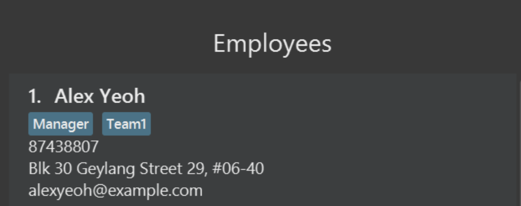
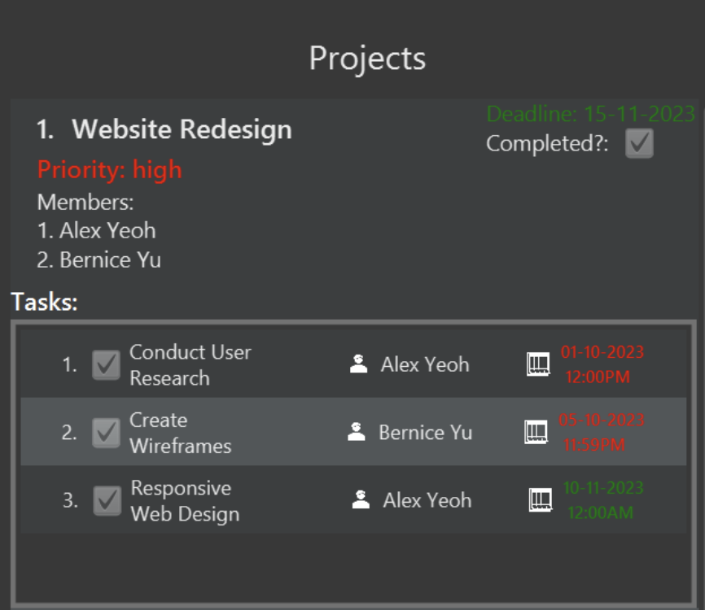
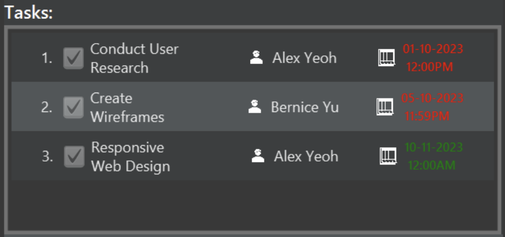
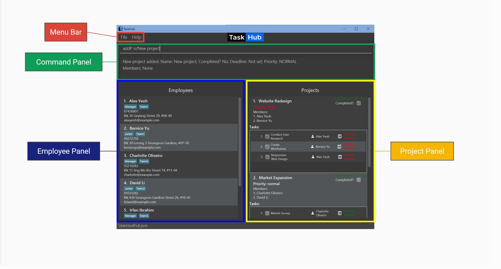
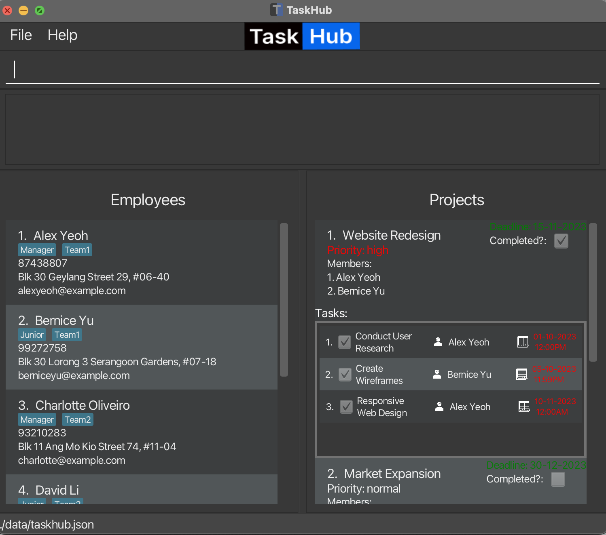
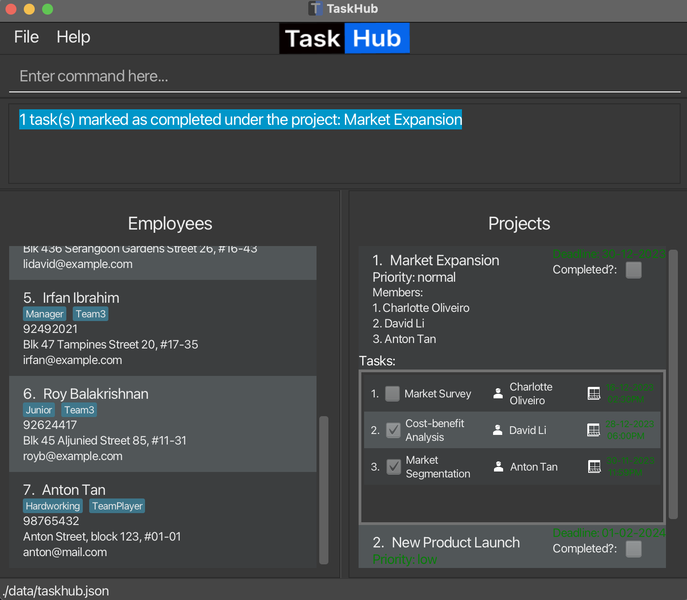
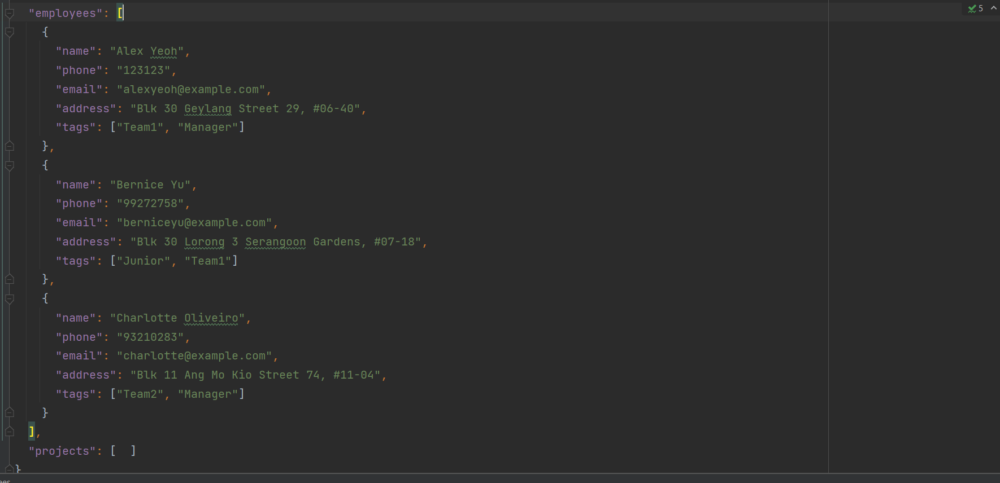

# Table of Contents
<!-- TOC -->
* [Introduction](#introduction)
  * [About TaskHub](#about-taskhub)
  * [About this User Guide](#about-this-user-guide)
  * [Navigating the User Guide](#navigating-the-user-guide)
* [Getting Started](#getting-started)
  * [Installing and launching TaskHub](#installing-and-launching-taskhub)
  * [Understanding the components of TaskHub](#understanding-the-components-of-taskhub)
  * [Understanding the User Interface (UI)](#understanding-the-user-interface-ui)
  * [Quick start](#quick-start)
* [Features](#features)
  * [General Commands](#general-commands)
    * [View help: `help`](#view-help-help)
    * [List all employees and projects: `list`](#list-all-employees-and-projects-list)
    * [Clear all entries: `clear`](#clear-all-entries-clear)
    * [Exit the program: `exit`](#exit-the-program-exit)
  * [Employee Commands](#employee-commands)
    * [Command Parameters](#command-parameters)
    * [Add an employee: `addE`](#add-an-employee-adde)
    * [Edit an employee: `editE`](#edit-an-employee-edite)
    * [Delete an employee: `deleteE`](#delete-an-employee-deletee)
    * [List all employees: `listE`](#list-all-employees-liste)
    * [Locate employees by name: `findE`](#locate-employees-by-name-finde)
  * [Project Commands](#project-commands)
    * [Command Parameters](#command-parameters-1)
    * [Add a new project: `addP`](#add-a-new-project-addp)
    * [Edit a project: `editP`](#edit-a-project-editp)
    * [Delete a project: `deleteP`](#delete-a-project-deletep)
    * [Mark project(s) as completed: `markP`](#mark-projects-as-completed-markp)
    * [Mark project(s) as incomplete: `unmarkP`](#mark-projects-as-incomplete-unmarkp)
    * [Edit deadline of (a) project(s): `dlP`](#edit-deadline-of-a-projects-dlp)
    * [Prioritise projects: `priorityP`](#prioritise-projects-priorityp)
    * [List all projects: `listP`](#list-all-projects-listp)
    * [Locate projects by name: `findP`](#locate-projects-by-name-findp)
  * [Task Commands](#task-commands)
    * [Command Parameters](#command-parameters-2)
    * [Add a new task to a project: `addT`](#add-a-new-task-to-a-project-addt)
    * [Delete a task from a project: `deleteT`](#delete-a-task-from-a-project-deletet)
    * [Mark task(s) as completed: `markT`](#mark-tasks-as-completed-markt)
    * [Mark task(s) as incomplete: `unmarkT`](#mark-tasks-as-incomplete-unmarkt)
    * [Sort tasks by deadline and completion status: `sortT`](#sort-tasks-by-deadline-and-completion-status-sortt)
  * [Assignment Commands](#assignment-commands)
    * [Command Parameters](#command-parameters-3)
    * [Assign employee(s) to a project: `assignP`](#assign-employees-to-a-project-assignp)
    * [Un-assign employee(s) from a project: `unassignP`](#un-assign-employees-from-a-project-unassignp)
    * [Assign an employee to a task: `assignT`](#assign-an-employee-to-a-task-assignt)
    * [Un-assign an employee from a task: `unassignT`](#un-assign-an-employee-from-a-task-unassignt)
  * [Data Storage](#data-storage)
    * [Save the data](#save-the-data)
    * [Edit the data file](#edit-the-data-file)
* [FAQ](#faq)
* [Known issues](#known-issues)
* [Command summary](#command-summary)
* [Appendix A: Installing Java](#appendix-a-installing-java)
<!-- TOC -->

--------------------------------------------------------------------------------------------------------------------
<div style="page-break-after: always;"></div>

# Introduction

## About TaskHub
Welcome to **TaskHub**, a powerful desktop application designed to make **project management** efficient and effortless.

With TaskHub, you will be able to:
* Store your employees' **contact information**
* Create and manage **projects** for your employees to be delegated to
* Create customized **tasks** for each project and assign your employees to them
* View all of your **employees, projects and tasks** at a glance

and much more!

TaskHub uses a **Command Line Interface (CLI)** for you to type in your desired **actions**. If you are a **fast typist**, this is perfect for you as it allows you to execute commands without having to leave the keyboard and gets your project management tasks done faster than traditional GUI apps.

TaskHub also uses a **Graphical User Interface (GUI)** to display **content and data**. This allows for data to be presented to you in an **elegant, fuss-free** manner.

Start to streamline your project management workflow today with TaskHub!

[Return to Table of Contents](#table-of-contents)


## About this User Guide

This user guide aims to provide you with all the information needed to get started with TaskHub.

If you are **new** to TaskHub, you may refer to the **[Navigating the User Guide](#navigating-the-user-guide)** section first, then to the **[Getting Started](#getting-started)** section to start installing and using TaskHub.

If you would like to find out more about its **individual features**, you may refer to the **[Features](#features)** section.

If you are an **experienced user** and want to quickly refer to the various commands, you may refer to the **[Command Summary](#command-summary)** section.

If you would like to find out more about the **technical aspects of TaskHub**, you may refer to our **[Developer Guide](https://ay2324s1-cs2103t-t08-3.github.io/tp/DeveloperGuide.html)**.

Finally, if you would like an **overview** of this entire user guide, you may refer to our **[Table of Contents](#table-of-contents)**.

[Return to Table of Contents](#table-of-contents)


## Navigating the User Guide

The following symbols will be used throughout this user guide to assist you.

<div markdown="span" class="alert alert-primary">

**:bulb: Tip:** Provides information that is not necessary to know, but could **enhance** your **user experience**.<br>

</div>

<div markdown="span" class="alert alert-info">

**:information_source: Information:** Provides information that will be **useful to know**.<br>

</div>

<div markdown="span" class="alert alert-warning">

**:warning: Warning:** Provides **important** information about a feature/command.<br>

</div>

<div markdown="span" class="alert alert-danger">

**:no_entry: Danger:** Provides **very important** information about a consequence (that could be **irreversible**) from a feature/command.<br>

</div>

Links:
* Words in blue are [links](#navigating-the-user-guide) that direct you to either a [section](#navigating-the-user-guide) of our user guide, or [another website](https://ay2324s1-cs2103t-t08-3.github.io/tp/).
* At the bottom of every main section, there will be a [Return to Table of Contents](#table-of-contents) link directing you to the Table of Contents, allowing you to quickly switch between different sections.

[Return to Table of Contents](#table-of-contents)

--------------------------------------------------------------------------------------------------------------------
<div style="page-break-after: always;"></div>

# Getting Started

## Installing and Launching TaskHub

### Step 1: Install Java

Ensure you have Java `11` or above installed on your computer. If you don't have Java installed, follow the steps in [Appendix A: Installing Java](#appendix-a-installing-java).

### Step 2: Download TaskHub

Download the latest `taskhub.jar` from [here](https://github.com/AY2324S1-CS2103T-T08-3/tp/releases).

### Step 3: Set up TaskHub Home Folder

Copy or move the downloaded `taskhub.jar` file to the folder you want to use as the _home folder_ for your TaskHub.

### Step 4: Launch TaskHub

1. Open a terminal (MacOS) or command prompt (Windows).

2. Navigate to the folder where you placed the `taskhub.jar` file using the `cd` command. For example, our friendly TaskHubber has his `taskhub.jar` file in `/Users/timothyleow/Developer/TaskHub`, so he'll run:

    ```bash
    cd /Users/timothyleow/Developer/TaskHub
    ```

3. Verify that your working directory contains `taskhub.jar` by using the `ls` command. You should see `taskhub.jar` in the list of files printed. Here's what our friendly TaskHubber got when running this command.

    ```bash
    timothyleow@timleows-MBP TaskHub % ls
    taskhub.jar
    ```
4. Once your terminal's working directory is the folder that contains `taskhub.jar`, run the following command to launch TaskHub:

    ```bash 
    java -jar taskhub.jar
    ```

   After executing this command, a graphical user interface (GUI) similar to the one below should appear shortly: 

   

   Note: The application comes with some sample data for your reference.

[Return to Table of Contents](#table-of-contents)

---

## Understanding the components of TaskHub

### Employees




An `Employee` is someone that you are managing. TaskHub allows you to store their essential details and `tag` them with their strengths and weaknesses so you can allocate them to suitable [`Projects`](#projects) or [`Tasks`](#tasks).

#### Attributes:

| Field        | Description                                                    | Prefix for [`addE`](#add-an-employee-adde) |
|--------------|----------------------------------------------------------------|--------------------------------------------|
| Name         | Name of the employee.                                          | `n/`                                       |
| Phone Number | Phone number of the employee.                                  | `p/`                                       |
| Email        | Email address of the employee.                                 | `e/`                                       |
| Address      | Address of the employee.                                       | `a/`                                       |
| Tags         | Tags indicating strengths/weaknesses/position of the employee. | `t/`                                       |

---

<div style="page-break-after: always;"></div>

### Projects



A `Project` in TaskHub is a managerial unit that includes information about [`Employees`](#employee) allocated to the project and an (optionally) set [deadline](#edit-deadline-of-a-projects-dlp). You can [mark](#mark-projects-as-completed-markp) a `Project` as done when you deem fit. Additionally, you can add `Tasks` to a `Project`.
#### Attributes:

| Field            | Description                                                | Prefix for [`addP`](#add-a-new-project-addp) | Relevant Command(s)                                                                             |
|------------------|------------------------------------------------------------|----------------------------------------------|-------------------------------------------------------------------------------------------------|
| Name             | Name of the project.                                       | `n/`                                         | -                                                                                               |
| Employees        | Employees assigned to the project.                         | `em/`                                        | [`assignP`](#assign-employees-to-a-project-assignp)                                             |
| Deadline         | Deadline for the project.                                  | -                                            | [`dlP`](#edit-deadline-of-a-projects-dlp)                                                       |
| Priority         | Priority level of the project.                             | -                                            | [`priorityP`](#prioritise-projects-priorityp)                                                   |
| CompletionStatus | Indicates whether the project is completed or in progress. | -                                            | [`markP`](#mark-projects-as-completed-markp), [`unmarkP`](#mark-projects-as-incomplete-unmarkp) |
| Tasks            | Tasks associated with the project.                         | -                                            | [`addT`](#add-a-new-task-to-a-project-addt)                                                     |

### Tasks



A `Task` in TaskHub represents a specific job within a `Project` that can be assigned to an `Employee` under that `Project`. Tasks are required to have a deadline. Managing `Task`s will be the main way of monitoring the work done within your `TaskHub`!

#### Attributes:

| Field    | Description                            | Prefix for [`addT`](#add-a-new-task-to-a-project-addt) | Relevant Command                                                                          |
|----------|----------------------------------------|--------------------------------------------------------|-------------------------------------------------------------------------------------------|
| Name     | Name of the task.                      | `n/`                                                   | -                                                                                         |
| Employee | Employee assigned to the task.         | `em/`                                                  | [`assignT`](#assign-an-employee-to-a-task-assignt)                                        |
| Deadline | Deadline for completing the task.      | `d/`                                                   | -                                                                                         |
| isDone   | Indicates whether the task is complete.| N.A.                                                   | [`markT`](#mark-tasks-as-completed-markt), [`unmarkT`](#mark-tasks-as-incomplete-unmarkt) |

[Return to Table of Contents](#table-of-contents)

<div style="page-break-after: always;"></div>

## Understanding the User Interface (UI)



TaskHub's UI consists of 4 main parts that you will be using for your project management:

### Menu Bar
* The menu bar is where you can exit TaskHub or even open the help window with a simple click of your mouse!
* While commands to exit TaskHub or open the help window can be entered as a command, this is a beginner-friendly alternative for newer users who might not be so familiar with the commands.

<div style="page-break-after: always;"></div>

#### Help:
Upon clicking help on the menu bar as shown below or by using the shortcut `F1`,


<div style="page-break-after: always;"></div>

a help window pops up with a list of all the possible commands:


and at the bottom of the window, is a link to our user guide.


<div style="page-break-after: always;"></div>

### Command Panel
* The command panel is the main panel that you will be interacting with to key in commands and also get back the results of those commands.
* The upper box is where you can type in your command.
* And the lower box is where you will see the results of those commands.

### Employee Panel
* The employee panel is one of two panels that you can use to see what is stored in TaskHub.
* The employee panel, as the name suggests, is where all the information about each employee is stored.
* You can see their name, phone number, address, email address, and even whatever tags that you have for each of them as needed!

### Project Panel
* The project panel is the other panel that you will be using to see the data stored in TaskHub.
* Projects, as well as their members, tasks to complete in the project, and other important details for managing your project are stored here!

[Return to Table of Contents](#table-of-contents)

<div style="page-break-after: always;"></div>

## Quick start
<div markdown="span" class="alert alert-warning">

**:warning: Warning:** The first step in the Quick Start guide involves `deleteP`, which is irreversible. If you wish to keep the sample data, then you can head straight to the [Features](#features) section below to figure out TaskHub on your own.

</div>

If you're okay with modifying the sample data, then we'll proceed with our first gist of project management with TaskHub. Time is ticking!

At this point, you should have installed Java 11 and be able to to run TaskHub without issues. If you haven't done so, you may return to the [Installation Guide](#installing-and-launching-taskhub).

If all is well, TaskHub should look something like this when you first run it:



### Step 1: Deleting a finished project
Hmmm, it seems like you're done with the 'Website Redesign Project'. Let's get rid of this data by running the below command.

```
deleteP 1
```

You should get the following response:

```
Deleted Project: 
Name: Website Redesign;
Completed? Yes;
Deadline: 15-11-2023;
Priority: HIGH
Members: Alex Yeoh, Bernice Yu
```
Now, you're looking at the 'Market Expansion' project, which we'll be focusing on.


### Step 2: Adding a new employee to TaskHub:
You've just got an email from your boss, saying that the fresh graduate that you recently interviewed is joining your team!

Here are his details:

| Name         | Anton Tan                       |
|--------------|---------------------------------|
| Phone Number | 98765432                        |
| Email        | anton@mail.com                  |
| Address      | Anton Street, block 123, #01-01 |
| Strengths    | TeamPlayer, Hardworking         |

Let's run the following command to add him to your team of [`Employees`](#employees).

```
addE n/Anton Tan p/98765432 e/anton@mail.com
 a/Anton Street, block 123, #01-01 t/TeamPlayer t/Hardworking
```

<div style="page-break-after: always;"></div>

You should get the following response:
```
New employee added: Anton Tan;
Phone: 98765432;
Email: anton@mail.com;
Address: Anton Street, block 123, #01-01;
Tags: [TeamPlayer][Hardworking]
```

### Step 3: Assigning an Employee to a Project in TaskHub:
You've decided that you need more help with the 'Market Expansion Project'. Let's run the following command to enlist Anton's help:
```
assignP pr/1 em/7
```

You should get the following response:
```
Member(s) have been assigned!
Name: Market Expansion; Completed? No; Deadline: 30-12-2023; Priority: NORMAL
Members: Charlotte Oliveiro, David Li, Anton Tan
```

### Step 4: Adding a Task to a Project:
Anton is eager to contribute to his newly assigned project. Since you've found that he is particularly skilled at Market Segmentation, let's run the following command to give him a task that he will excel at. To measure his capabilities, you'll only give him until the end of November to complete this.
```
addT n/Market Segmentation pr/1 em/3 d/30-11-2023 2359
```

You should get the following response:
```
New task added to project 1, 
Description: Market Segmentation;
Deadline: 30 Nov 2023, 11:59PM;
Assignee: Anton Tan
```

### Step 5: Marking a Task as Complete:
It's the next morning. You receive an eager email from Anton reporting that he's already completed the Market Segmentation `Task`. After reviewing his report, you are thoroughly impressed and wish to mark his work as done in `TaskHub`. Let's run this command:
```
markT pr/1 t/3
```

You should get the following response:
```
1 task(s) marked as completed under the project: Market Expansion
```

If you've followed the steps correctly, TaskHub should look something like this now:

Scroll down in the `Employees` pane to notice Anton, the newest addition to your team.



[Return to Table of Contents](#table-of-contents)

For a more comprehensive overview of what you can achieve with TaskHub, you may proceed to the [Features](#features) section below.

--------------------------------------------------------------------------------------------------------------------

# Features

<div markdown="block" class="alert alert-info">

**:information_source: Notes about the command format:**<br>

* Words in `UPPER_CASE` are the parameters to be supplied by the user.<br>
  e.g. in `addE n/NAME`, `NAME` is a parameter which can be used as `addE n/John Doe`.

* Items in square brackets are optional.<br>
  e.g. `n/NAME [t/TAG]` can be used as `n/John Doe t/friend` or as `n/John Doe`.

* Items with `…`​ after them can be used multiple times including zero times.<br>
  e.g. `[t/TAG]…​` can be used as ` ` (i.e. 0 times), `t/friend`, `t/friend t/family` etc.

* Parameters can be in any order.<br>
  e.g. if the command specifies `n/NAME p/PHONE_NUMBER`, `p/PHONE_NUMBER n/NAME` is also acceptable.

* All commands that can take in multiple index**es** should have its indexes separated by **single** spaces.<br>
e.g. if the command specifies `INDEX [MORE_INDEXES]`, it should be entered as `1 2 3` instead of `1  2  3`.

* Extraneous parameters for commands that do not take in parameters (such as `help`, `list`, `listE`, `listP`, `exit` and `clear`) will be ignored.<br>
  e.g. if the command specifies `help 123`, it will be interpreted as `help`.

* Commands that contain `[MORE INDEXES]` are able to take in more than one index for the relevant parameter, separated by spaces.<br>
  e.g. `1`, `2 5 4`, `3 7`

* If you are using a PDF version of this document, be careful when copying and pasting commands that span multiple lines as space characters surrounding line-breaks may be omitted when copied over to the application.
</div>

[Return to Table of Contents](#table-of-contents)

<br>

## General Commands

### View help: `help`

Enter a `help` command into TaskHub to quickly display the same help window without having to click on help.

Format: `help`


### List all employees and projects: `list`

Shows a list of all employees and projects in TaskHub.

Format: `list`


### Clear all entries: `clear`

Clears all entries from TaskHub.

Format: `clear`

<div markdown="block" class="alert alert-danger">

**:no_entry: Danger**<br>

* This action is irreversible.
* Please ensure that you are certain that you want to delete all existing employees, projects and tasks before proceeding.

</div>


### Exit the program: `exit`

Exits the program.

Format: `exit`

[Return to Table of Contents](#table-of-contents)

<br>

## Employee Commands

<br>

<a name="command-parameters"></a>
<!-- The table below is inspired by https://ay2324s1-cs2103t-w08-1.github.io/tp/UserGuide.html#command-parameters-1 -->
### Command Parameters

| Parameter | Description​                                                                                                                                                                                                                                                                                                                                                                                                                                                                                                                                                                                                                                                                                                     | Examples​                                          |
|-----------|------------------------------------------------------------------------------------------------------------------------------------------------------------------------------------------------------------------------------------------------------------------------------------------------------------------------------------------------------------------------------------------------------------------------------------------------------------------------------------------------------------------------------------------------------------------------------------------------------------------------------------------------------------------------------------------------------------------|----------------------------------------------------|
| `NAME`    | The employee's name.<br/><br/> It should only contain alphanumeric characters and spaces.<br/><br/> It should not be blank and should not exceed 80 characters.                                                                                                                                                                                                                                                                                                                                                                                                                                                                                                                                                  | - `John Doe`<br/> - `Vishnu`                       |
| `PHONE`   | The employee's phone number.<br/><br/> It should only contain numbers.<br/><br/> It should be at least 3 digits long and should not exceed 20 digits.                                                                                                                                                                                                                                                                                                                                                                                                                                                                                                                                                            | - `91822213`<br/> - `9313491028503`                |
| `EMAIL`   | The employee's email.<br/><br/> It should be of the format **local-part@domain**.<br/><br/> The **local-part** should only contain alphanumeric characters and these special characters, excluding the parentheses, (+_.-)<br/><br/> This is followed by a **'@'** and then a **domain name**. The **domain name** is made up of **domain labels** separated by periods. The **domain name** must end with a **domain label** at least 2 characters long, have each **domain label** start and end with alphanumeric characters, and have each **domain label** consist of alphanumeric characters, separated only by hyphens, if any.<br/><br/> The total length of the email should not exceed 100 characters. | -`john.doe@gmail.com`<br/> - `bernice@hotmail.com` |
| `ADDRESS` | The employee's address.<br/><br/> It can take any values, and it should not be blank.<br/><br/> It should not exceed more than 100 characters.                                                                                                                                                                                                                                                                                                                                                                                                                                                                                                                                                                   | - `Ang Mo Kio Industrial Park 2 #01-1427`          |
| `TAG`     | The employee's tag(s).<br/><br/> It should only contain alphanumeric characters.<br/><br/> It should not exceed more than 40 characters.                                                                                                                                                                                                                                                                                                                                                                                                                                                                                                                                                                         | - `Manager`<br/> - `Team1`                         |
| `INDEX`   | The index number of the employee as shown in the employee panel.<br/><br/> It should be a positive integer, and should not be more than the number of employees currently shown in the displayed employee panel. It should be less than 1000.                                                                                                                                                                                                                                                                                                                                                                                                                                                                    | - `1`                                              |
| `KEYWORD` | The keyword to find an employee by name.<br/><br/> It should only contain alphanumeric characters and spaces. <br/><br/> It is case-insensitive.                                                                                                                                                                                                                                                                                                                                                                                                                                                                                                                                                                 | - `Alex`<br/> - `alex yeoh`                        |

Note that some of the limits for the parameters stated above are not enforced by the application. You are recommended to follow these limits for the best user experience. We may enforce them in a future iteration.

[Return to Table of Contents](#table-of-contents)

<br>

### Add an employee: `addE`

Adds an employee to the employees list.

Format: `addE n/NAME p/PHONE e/EMAIL a/ADDRESS [t/TAG]…​`

<div markdown="span" class="alert alert-primary">:bulb: **Tip:**
An employee can have any number of tags (including 0)
</div>

Examples:
* `addE n/John Doe p/98765432 e/johnd@example.com a/John street, block 123, #01-01`
* `addE n/Betsy Crowe t/Junior e/betsycrowe@example.com a/Brick street p/91234567 t/Employee`

[Return to Table of Contents](#table-of-contents)


### Edit an employee: `editE`

Edits an existing employee in the TaskHub.

Format: `editE INDEX [n/NAME] [p/PHONE] [e/EMAIL] [a/ADDRESS] [t/TAG]…​`

* Edits the employee at the specified `INDEX`.
* The index refers to the index number shown in the displayed employee panel.
* The index **must be a positive integer** 1, 2, 3, …​
* At least one of the optional fields must be provided.
* Existing values will be updated to the input values.
* When editing tags, the existing tags of the employee will be removed i.e. adding of tags is not cumulative.
* You can remove all the employee’s tags by typing `t/` without
  specifying any tags after it.

Examples:
*  `editE 1 p/91234567 e/johndoe@example.com` Edits the phone number and email address of the 1st employee to be `91234567` and `johndoe@example.com` respectively.
*  `editE 2 n/Betsy Crower t/` Edits the name of the 2nd employee to be `Betsy Crower` and clears all existing tags.

[Return to Table of Contents](#table-of-contents)


### Delete an employee: `deleteE`

Deletes the specified employee from the employees list.

Format: `deleteE INDEX`

* Deletes the employee at the specified `INDEX`.
* The index refers to the index number shown in the displayed employee panel.
* The index **must be a positive integer** 1, 2, 3, …​

<div markdown="block" class="alert alert-danger">

**:no_entry: Danger**<br>

* This action is irreversible.
* Please ensure that you are certain that you want to delete the employee before proceeding.

</div>

Examples:
* `listE` followed by `deleteE 2` deletes the 2nd employee in the employees list.
* `findE Betsy` followed by `deleteE 1` deletes the 1st employee in the results of the `findE` command.

[Return to Table of Contents](#table-of-contents)


### List all employees: `listE`

Shows a list of all employees in TaskHub.


Format: `listE`

[Return to Table of Contents](#table-of-contents)


### Locate employees by name: `findE`

Finds employees whose names contain any of the given keywords.
Additionally, it shows only the projects that these employees are under.

Format: `findE KEYWORD [MORE_KEYWORDS]…​`

* The search is case-insensitive. e.g. `hans` will match `Hans`
* The order of the keywords does not matter. e.g. `Hans Bo` will match `Bo Hans`
* Only the name is searched.
* Only full words will be matched e.g. `Han` will not match `Hans`
* Employees matching at least one keyword will be returned (i.e. `OR` search).
  e.g. `Hans Bo` will return `Hans Gruber`, `Bo Yang`

Examples:
* `findE John` returns `john` and `John Doe`
* `findE alex david` returns `Alex Yeoh`, `David Li`
* `findE david` returns `David Li` <br> 

  

[Return to Table of Contents](#table-of-contents)

<br>

## Project Commands

<br>

<a name="command-parameters-1"></a>
<!-- The table below is inspired by https://ay2324s1-cs2103t-w08-1.github.io/tp/UserGuide.html#command-parameters-1 -->
### Command Parameters

| Parameter              | Description​                                                                                                                                                                                                                                  | Examples​                                               |
|------------------------|-----------------------------------------------------------------------------------------------------------------------------------------------------------------------------------------------------------------------------------------------|---------------------------------------------------------|
| `NAME`/ `PROJECT_NAME` | The project's name.<br/><br/> It should only contain alphanumeric characters and spaces.<br/><br/> It should not be blank and should not exceed 80 characters.                                                                                | - `Website Redesign`<br/> - `Market Sentiment Analysis` |
| `EMPLOYEE_INDEX`       | The index number of the employee as shown in the employee panel.<br/><br/> It should be a positive integer, and should not be more than the number of employees currently shown in the displayed employee panel. It should be less than 1000. | - `1`                                                   |
| `INDEX`                | The index number of the project as shown in the project panel.<br/><br/> It should be a positive integer, and should not be more than the number of projects currently shown in the displayed project panel. It should be less than 1000.     | - `2`                                                   |
| `PRIORITY`             | The project's priority level.<br/><br/> It should only take one of these 3 values: `low`, `normal`, `high`.                                                                                                                                   | - `low`<br/> - `high`                                   |
| `DEADLINE`             | The project's deadline date.<br/><br/> It can either be empty (to indicate that there is no deadline set), or it must be a valid date in the `dd-MM-yyyy` format.                                                                             | - `28-02-2024`<br/> - `08-11-2022`                      |
| `KEYWORD`              | The keyword to find a project by name.<br/><br/> It should only contain alphanumeric characters and spaces. <br/><br/> It is case-insensitive.                                                                                                | - `Website`<br/> - `create website`                     |

Note that some of the limits for the parameters stated above are not enforced by the application. You are recommended to follow these limits for the best user experience. We may enforce them in a future iteration.

[Return to Table of Contents](#table-of-contents)

<br>

### Add a new project: `addP`

Adds a new project in TaskHub.

Format: `addP n/PROJECT_NAME [em/EMPLOYEE_INDEX(ES)]`

* Adds a new project with the given name, and assigns employee(s) to this project if `EMPLOYEE_INDEX(ES)` are provided.
* The index(es) refers to the index number(s) shown in the displayed employee panel.
* If multiple indexes are provided, each employee index __must be separated by a singular space__.
* The index(es) **must be a positive integers** 1, 2, 3,...
* There is no deadline set by default.
* The priority is `normal` by default.
* The status is `not completed` by default.

<div markdown="span" class="alert alert-info">

**:information_source: Information:** If the newly added project does not show up in the project panel, try running `list` or `listP`.<br>

</div>

Examples: 
* `addP n/Project1 em/1` will add `Project1` to the projects list, and assigns the employee at index 1 currently displayed in the employee panel to this project.
* `addP n/Project2` will add an empty `Project2` to the projects list.

[Return to Table of Contents](#table-of-contents)


### Edit a project: `editP`

Edits an existing project in TaskHub.

Format: `editP INDEX [n/NAME] [p/PRIORITY] [d/DEADLINE]`

* Edits the project at the specified `INDEX`.
* The index refers to the index number shown in the displayed project panel.
* The index **must be a positive** integer 1, 2, 3, …​
* At least one of the optional fields must be provided.
* Existing values will be updated to the input values.
* If a `DEADLINE` date is provided, it must be in the `dd-MM-yyyy` format.
* You can remove the `DEADLINE` of the project by typing `d/` without specifying any deadline after it.
* You can also provide a `DEADLINE` date e.g. `d/01-01-2024`, in which case the provided deadline will overwrite the current deadline (if any).

Examples:
* `editP 1 n/Market Analysis p/low` Edits the name and priority of the 1st project to `Market Analysis` and `low` respectively.
* `editP 2 p/high d/` Edits 2nd project's priority to `high` and removes the deadline.

[Return to Table of Contents](#table-of-contents)


### Delete a project: `deleteP`

Deletes the specified project from TaskHub.

Format: `deleteP INDEX`
* Deletes the project at the specified `INDEX`.
* The index refers to the index number shown in the displayed project panel.
* The index __must be a positive integer__ 1, 2, 3,...

<div markdown="block" class="alert alert-danger">

**:no_entry: Danger**<br>

* This action is irreversible.
* Please ensure that you are certain that you want to delete the project before proceeding.

</div>

Examples:
* `listP` followed by `deleteP 2` deletes the 2nd project in TaskHub.

[Return to Table of Contents](#table-of-contents)


### Mark project(s) as completed: `markP`

Marks the specified project(s) as completed in TaskHub.

Format: `markP INDEX [MORE_INDEXES]`

* Marks the project(s) at the specified `INDEX(ES)` as completed.
* The index(es) refers to the index number(s) shown in the displayed project panel.
* If multiple indexes are provided, each index __must be separated by a singular space__.
* The index(es) **must be a positive integer** 1, 2, 3,...

Examples:
* `listP` followed by `markP 1 3` marks the 1st and 3rd projects as completed in TaskHub.
* `findP Capstone` followed by `markP 1` marks the 1st project in the results of the `findP` command as completed.

[Return to Table of Contents](#table-of-contents)


### Mark project(s) as incomplete: `unmarkP`

Marks the specified project(s) as incomplete in TaskHub.

Format: `unmarkP INDEX [MORE_INDEXES]`

* Marks the project(s) at the specified `INDEX(ES)` as incomplete.
* The index(es) refers to the index number(s) shown in the displayed projects panel.
* If multiple indexes are provided, each index __must be separated by a singular space__.
* The index(es) **must be a positive integer** 1, 2, 3,...

Examples:
* `listP` followed by `unmarkP 1 3` marks the 1st and 3rd projects as incomplete in TaskHub.
* `findP Capstone` followed by `unmarkP 1` marks the 1st project in the results of the `findP` command as incomplete.

[Return to Table of Contents](#table-of-contents)


### Edit deadline of (a) project(s): `dlP`

Edits the deadline of the specified project(s) in Taskhub.

Format: `dlP INDEX [MORE_INDEXES] d/[DEADLINE]`

* Edits the deadline of the project(s) at the specified `INDEX(ES)`.
* The index(es) refers to the index number(s) shown in the displayed project panel.
* If multiple indexes are provided, each index __must be separated by a singular space__.
* The index(es) **must be a positive integer** 1, 2, 3, …
* The `d/` prefix is required, but the `DEADLINE` is optional.
* If a date is provided, it must be in the `dd-MM-yyyy` format.
* Existing deadline will be updated to the new deadline for each project.
* To remove the deadline of a project, leave the `DEADLINE` blank.

Examples:
*  `dlP 2 d/18-01-2022` sets the deadline of the 2nd project to be `18-01-2022`.
*  `dlP 1 2 d/` removes the deadline of the 1st and 2nd projects.
*  `findP Infinity` followed by `dlP 1 d/25-11-2024` sets the deadline of the 1st project in the results of the `findP` command to be `25-11-2024`.

[Return to Table of Contents](#table-of-contents)


### Prioritise projects: `priorityP`

Sets a priority for the specified project(s) in TaskHub.

Format: `priorityP INDEX [MORE_INDEXES] p/PRIORITY`
* Sets the priority of the project(s) at the specified `INDEX(ES)`.
* The index(es) refers to the index number(s) shown in the displayed project panel.
* If multiple indexes are provided, each index __must be separated by a singular space__.
* The index(es) __must be a positive integer__ 1, 2, 3,...
* The `PRIORITY` must be one of: `low`, `normal` or `high`.

Examples:
* `listP` followed by `priorityP 1 2 p/high` sets the 1st and 2nd projects as high priority in TaskHub.

[Return to Table of Contents](#table-of-contents)


### List all projects: `listP`

Shows a list of all projects in TaskHub.


Format: `listP`

[Return to Table of Contents](#table-of-contents)


### Locate projects by name: `findP`

Find projects whose names contain any of the given keywords.
Additionally, it shows only the employees that are under these projects.

Format: `findP KEYWORD [MORE_KEYWORDS]…​`

* The search is case-insensitive. e.g. `website` will match `Website`
* The order of the keywords does not matter. e.g. `Create Website` will match `Website Create`
* Only the name is searched.
* Only full words will be matched e.g. `Website` will not match `Websites`
* Projects matching at least one keyword will be returned (i.e. `OR` search).
  e.g. `Website Model` will return `Create Website`, `Build Model`

Examples:
* `findP website model` returns `Create Website`, `Build Model`
* `findP market` returns `Market Expansion` <br>
  

[Return to Table of Contents](#table-of-contents)

<br>

## Task Commands

<br>

<a name="command-parameters-2"></a>
<!-- The table below is inspired by https://ay2324s1-cs2103t-w08-1.github.io/tp/UserGuide.html#command-parameters-1 -->
### Command Parameters

| Parameter        | Description​                                                                                                                                                                                                                                           | Examples​                                            |
|------------------|--------------------------------------------------------------------------------------------------------------------------------------------------------------------------------------------------------------------------------------------------------|------------------------------------------------------|
| `TASK_NAME`      | The task's name.<br/><br/> It should only contain alphanumeric characters and spaces.<br/><br/> It should not be blank and should not exceed 80 characters.                                                                                            | - `Create Wireframes`<br/> - `Responsive Web Design` |
| `PROJECT_INDEX`  | The index number of the project as shown in the project panel.<br/><br/> It should be a positive integer, and should not be more than the number of projects currently shown in the displayed project panel. It should be less than 1000.              | - `1`                                                |
| `EMPLOYEE_INDEX` | The index number of the employee as shown in the specified project on the project panel.<br/><br/> It should be a positive integer, and should not be more than the number of employees present in the specified project. It should be less than 1000. | - `2`                                                |
| `TASK_INDEX`     | The index number of the task as shown in the specified project on the project panel.<br/><br/> It should be a positive integer, and should not be more than the number of tasks currently in the specified project. It should be less than 1000.       | - `3`                                                |
| `DEADLINE`       | The task's deadline.<br/><br/> It must be a valid date and time in the `dd-MM-yyyy HHmm` format.                                                                                                                                                       | - `11-11-2023 2359`<br/> - `28-02-2024 0900`         |

Note that some of the limits for the parameters stated above are not enforced by the application. You are recommended to follow these limits for the best user experience. We may enforce them in a future iteration.

[Return to Table of Contents](#table-of-contents)

<br>

### Add a new task to a project: `addT`

Adds a new task to the specified project in TaskHub and assigns it to the (optionally) specified employee.

Format: `addT n/TASK_NAME pr/PROJECT_INDEX [em/EMPLOYEE_INDEX] d/DEADLINE`

* Adds a new task to the project at the specified `PROJECT_INDEX`.
* The employee index field is optional - the task will be assigned to the employee at `EMPLOYEE_INDEX` if specified,
* otherwise it will have no assignee, and `assignT` can be used after that to assign it to an employee.
* The indexes **must be positive integers** 1, 2, 3,...
* The deadline must be in the format `dd-MM-yyyy HHmm`.
* It is possible for the deadline of the task to be after the deadline of the project.

Examples:
* `listP` followed by `addT pr/1 n/Website d/11-10-2023 2359` adds a task named `Website` with deadline `11-10-2023 2359` to the 1st project.
* `findP Capstone` followed by `addT pr/1 n/Website d/11-10-2023 2359` adds a task named `Website` with deadline `11-10-2023 2359` to the 1st project from the result of the `findP` command.

[Return to Table of Contents](#table-of-contents)


### Delete a task from a project: `deleteT`

Delete the specified task(s) from the specified project in TaskHub.

Format: `deleteT pr/PROJECT_INDEX t/TASK_INDEX [MORE_TASK_INDEXES]`

* Delete the task(s) at the specified `TASK_INDEX`(es), from the project at the specified `PROJECT_INDEX`.
* The project index refers to the index number shown in the displayed project panel.
* The task index(es) refer to the index number(s) shown in the task list of the above specified project.
* The indexes **must be positive integers** 1, 2, 3,...

<div markdown="block" class="alert alert-danger">

**:no_entry: Danger**<br>

* This action is irreversible.
* Please ensure that you are certain that you want to delete the task before proceeding.

</div>

Examples:
* `listP` followed by `deleteT pr/1 t/1 3` deletes the 1st and 3rd tasks of the 1st project from TaskHub.
* `findP Capstone` followed by `deleteT pr/2 t/2` deletes the 2nd task in the 2nd project from the results of the `findP` command.

[Return to Table of Contents](#table-of-contents)


### Mark task(s) as completed: `markT`

Marks the specified task(s) of a specified project as completed in TaskHub.

Format: `markT pr/PROJECT_INDEX t/TASK_INDEX [MORE_TASK_INDEXES]`

* Marks the tasks(s) at the specified `TASK_INDEX`(es), of the project at the specified `PROJECT_INDEX` as completed.
* The project index refers to the index number shown in the displayed project panel.
* The task index(es) refer to the index number(s) shown in the task list of the above specified project.
* If multiple indexes are provided, each index __must be separated by a singular space__.
* The indexes **must be positive integers** 1, 2, 3,...

Examples:
* `listP` followed by `markT pr/1 t/1 3` marks the 1st and 3rd tasks of the 1st project as completed in TaskHub.
* `findP Capstone` followed by `markT pr/2 t/2` marks the 2nd task in the 2nd project from the results of the `findP` command as completed.

[Return to Table of Contents](#table-of-contents)


### Mark task(s) as incomplete: `unmarkT`

Marks the specified task(s) of a specified project as incomplete in TaskHub.

Format: `unmarkT pr/PROJECT_INDEX t/TASK_INDEX [MORE_TASK_INDEXES]`

* Marks the tasks(s) at the specified `TASK_INDEX`(es), of the project at the specified `PROJECT_INDEX` as incomplete.
* The project index refers to the index number shown in the displayed project panel.
* The task index(es) refer to the index number(s) shown in the task list of the above specified project.
* If multiple indexes are provided, each index __must be separated by a singular space__.
* The indexes **must be positive integers** 1, 2, 3,...

Examples:
* `listP` followed by `unmarkT pr/1 t/1 3` marks the 1st and 3rd tasks of the 1st project as incomplete in TaskHub.
* `findP Capstone` followed by `unmarkT pr/2 t/2` marks the 2nd task in the 2nd project from the results of the `findP` command as incomplete.

[Return to Table of Contents](#table-of-contents)


### Sort tasks by deadline and completion status: `sortT`

Sorts the tasks in each project in the displayed project panel by their deadline and completion status.

Format: `sortT`

* The sorting of tasks is done within each project i.e. tasks from different projects are not compared.
* Incomplete tasks will be placed before completed ones and tasks with an earlier deadline will be placed before those with a later one.
* Completion status takes precedence over deadline i.e. an incomplete task with a later deadline will be placed before a completed task with an earlier deadline.

[Return to Table of Contents](#table-of-contents)

<br>

## Assignment Commands

<br>

<a name="command-parameters-3"></a>
<!-- The table below is inspired by https://ay2324s1-cs2103t-w08-1.github.io/tp/UserGuide.html#command-parameters-1 -->
### Command Parameters

| Parameter        | Description​                                                                                                                                                                                                                                                                                                                                                                                                                                                                                                                                                                                                                                  | Examples​ |
|------------------|-----------------------------------------------------------------------------------------------------------------------------------------------------------------------------------------------------------------------------------------------------------------------------------------------------------------------------------------------------------------------------------------------------------------------------------------------------------------------------------------------------------------------------------------------------------------------------------------------------------------------------------------------|-----------|
| `PROJECT_INDEX`  | The index number of the project as shown in the project panel.<br/><br/> It should be a positive integer, and should not be more than the number of projects currently shown in the displayed project panel. It should be less than 1000.                                                                                                                                                                                                                                                                                                                                                                                                     | - `1`     |
| `EMPLOYEE_INDEX` | This has slightly different meanings depending on the command that uses this parameter.<br/><br/> `assignP`/`unassignP`:<br/><br/> The index number of the employee as shown in the employee panel.<br/><br/> It should not be more than the number of employees currently shown in the displayed employee panel.<br/><br/> `assignT`:<br/><br/> The index number of the employee as shown in the specified project on the project panel.<br/><br/> It should not be more than the number of employees present in the specified project.<br/><br/> `In all cases`:<br/><br/> It should be a positive integer and it should be less than 1000. | - `2`     |
| `TASK_INDEX`     | The index number of the task as shown in the specified project on the project panel.<br/><br/> It should be a positive integer, and should not be more than the number of tasks currently in the specified project. It should be less than 1000.                                                                                                                                                                                                                                                                                                                                                                                              | - `3`     |

Note that some of the limits for the parameters stated above are not enforced by the application. You are recommended to follow these limits for the best user experience. We may enforce them in a future iteration.

[Return to Table of Contents](#table-of-contents)

<br>


### Assign employee(s) to a project: `assignP`

Assigns employee(s) to a project in TaskHub.

Format: `assignP pr/PROJECT_INDEX em/EMPLOYEE_INDEX [MORE_EMPLOYEE_INDEXES] ...`
* The employee(s) specified by the `EMPLOYEE_INDEX(ES)` will be assigned to the project specified by the `PROJECT_INDEX`.
* The project index refers to the index number shown in the displayed project panel.
* The employee index(es) refer to the index number(s) shown in the displayed employee panel.
* If multiple indexes are provided, each index __must be separated by a singular space__.
* The indexes **must be positive integers** 1, 2, 3,...

Examples:
* `list` followed by `assignP pr/2 em/1 3` will assign the 1st and 3rd employees to the 2nd project.
* `findP Capstone` followed by `assignP pr/1 em/1` will assign the 1st employee to the 1st project from the results of the `findP` command.

[Return to Table of Contents](#table-of-contents)


### Un-assign employee(s) from a project: `unassignP`

Un-assigns employee(s) from a project in TaskHub.

Format: `unassignP pr/PROJECT_INDEX em/EMPLOYEE_INDEX [MORE_EMPLOYEE_INDEXES] ...`

* The employee(s) specified by the `EMPLOYEE_INDEX(ES)` will be un-assigned from the project specified by the `PROJECT_INDEX`.
* The project index refers to the index number shown in the displayed project panel.
* The employee index(es) refer to the index number(s) shown in the displayed employee panel.
* If multiple indexes are provided, each index __must be separated by a singular space__.
* The indexes **must be positive integers** 1, 2, 3,...

<div markdown="block" class="alert alert-warning">

**:warning: Warning**<br>

* If an employee to be unassigned from the project is currently assigned to a task within the project, the employee will be unassigned from the task as well.

</div>

Examples:
* `list` followed by `unassignP pr/2 em/1 3` will un-assign the 1st and 3rd employees from the 2nd project.
* `findP Capstone` followed by `unassignP pr/1 em/1` un-assigns the 1st employee from the 1st project from the results of the `findP` command.

[Return to Table of Contents](#table-of-contents)


### Assign an employee to a task: `assignT`

Assigns a specified employee in a specified project to a specified task in that project.

Format: `assignT pr/PROJECT_INDEX t/TASK_INDEX em/EMPLOYEE_INDEX`

* The employee specified by the `EMPLOYEE_INDEX` will be assigned to the task specified by the `TASK_INDEX` in the project specified by the `PROJECT_INDEX`.
* The project index refers to the index number shown in the displayed project panel.
* The task index refers to the index number of the task as shown in the **specified project** on the project panel. 
* The employee index refers to the index number of the employee as shown in the **specified project** on the project panel.
* The indexes **must be positive integers** 1, 2, 3,...

<div markdown="block" class="alert alert-warning">

**:warning: Warning**<br>

* In this version of TaskHub, only a single employee can be assigned to a task at a time.
* Assigning a task that has already been assigned to another employee will overwrite that employee.

</div>

Examples:
* `listP` followed by `assignT pr/1 t/1 em/2` assigns the first task in the first project to the second employee in the project.
* `findP Capstone` followed by `assignT pr/2 t/2 em/2` assigns the second task, in the second project from the results of `findP`, to the second employee in the project.

[Return to Table of Contents](#table-of-contents)


### Un-assign an employee from a task: `unassignT`

Un-assigns the currently assigned employee from the specified task in the specified project.

Format: `unassignT pr/PROJECT_INDEX t/TASK_INDEX`

* The currently assigned employee, if exists, will be un-assigned from the task specified by the `TASK_INDEX` in the project specified by the `PROJECT_INDEX`.
* The project index refers to the index number shown in the displayed project panel.
* The task index refers to the index number of the task as shown in the **specified project** on the project panel.
* The indexes **must be positive integers** 1, 2, 3,...

Examples:
* `listP` followed by `unassignT pr/1 t/1` un-assigns the first task in the first project from the currently assigned employee.
* `findP Capstone` followed by `unassignT pr/2 t/2` un-assigns the second task, in the second project from the results of `findP`, from the currently assigned employee.

[Return to Table of Contents](#table-of-contents)

<br>

## Data Storage

### Save the data

TaskHub's data is saved in the hard disk automatically after any command that changes the data. There is no need to save manually.

### Edit the data file

TaskHub data are saved automatically as a JSON file `[JAR file location]/data/taskhub.json`. Advanced users are welcome to update data directly by editing that data file.

<div markdown="span" class="alert alert-danger">

:no_entry: **Danger:**
If your changes to the data file makes its format invalid, TaskHub will discard all data and start with an empty data file at the next run. Hence, it is recommended to take a backup of the file before editing it.
More details are provided under the [FAQ Section](#faq). <br>

</div>

[Return to Table of Contents](#table-of-contents)

--------------------------------------------------------------------------------------------------------------------

# FAQ

**Q**: Why is all my TaskHub data gone?<br>
**A**: Most likely, your data is still mostly intact, so it is recommended to exit the app first by manually closing the window or the shortcut `Alt + F4` as executing some commands such as `addE`,`exit` and `clear` will clear the previously stored data in this situation.
Taskhub may appear empty as it requires all data stored in the data file to be in the correct format so that it can be read back to TaskHub. A TaskHub that suddenly becomes empty indicates an issue with the data file.<br>

<div markdown="span" class="alert alert-info">

:information_source:
**The solution below assumes that you are familiar with files in the `.json` format, and how TaskHub stores data. If you are unfamiliar, please check out** **[this website](https://www.w3schools.com/js/js_json_intro.asp) to know more about `.json` files** <br>
If you have directly changed any data in the `taskhub.json` file instead of through TaskHub, it is highly likely that it would be in the wrong format, resulting in an empty TaskHub.<br>
To attempt to recover as much data as possible, it is recommended to save a copy of the `taskhub.json` file somewhere else and perform the following actions:<br>
1. Remove all projects from your `taskhub.json` file. (`"projects" : []` should be the result after this operation, like the image shown below)<br>

2. Run TaskHub with the edited `taskhub.json` file. If the list of employees is shown, then the problem lies in your projects. Otherwise, a format error lies in the `"employee"` section of your json file. 
It is recommended to start from scratch because most likely your projects and tasks that involve the employee have different degree of changes, and it might be impractical to manually change each occurence of the employee.  
3. Now, add each project one by one, ensuring that TaskHub can run normally after each project addition. If TaskHub appears empty after the addition of a particular project, it is most likely that the employees in the project are different from those stored in TaskHub.
Check the employees assigned in your project and employees assigned to relevant tasks, making sure every field is equal to its counterpart in the employee list.<br>
While checking an employee assigned to a task, make sure the employee is the same employee in the project and in the employee list. Each project should have this format:

4. Repeat the step above until every project is added to TaskHub.<br>
If you have not changed anything, ensure your `data` folder containing your `taskhub.json` is in the same folder as your `taskhub.jar`.<br>

</div>

**Q**: Why is TaskHub not loading for me?<br>
**A**: If you did modify your `taskhub.json` file, it is most likely that you put the keyword `null` somewhere in the json file. Removing these keywords should at least present to you an empty TaskHub.<br>
Another possibility is that your `taskhub.log` or `taskhub.json` files are set to read-only.<br>
The first step is to open the folder that contains all your files related to TaskHub.
* For Windows users, right-click each file in your file explorer, click on properties and untick `Read-only` in `Attributes`.<br>
* For MacOS users, for each file in Finder choose `File` > `Get Info` > `Sharing & Permissions`. Set the privilege for yourself to be `Read & Write`.<br>
* For Linux users, run `chmod a+rw *` in your terminal. If you have difficulty navigating to your directory that contains the files, check out the "Navigation and Exploration" section of [this website](https://www.digitalocean.com/community/tutorials/basic-linux-navigation-and-file-management).<br> 


**Q**: How do I transfer my data to another Computer?<br>
**A**: Install the app in the other computer and overwrite the empty data file it creates with the file that contains the data of your previous TaskHub home folder.

[Return to Table of Contents](#table-of-contents)

--------------------------------------------------------------------------------------------------------------------

# Known issues

1. **When using multiple screens**, if you move the application to a secondary screen, and later switch to using only the primary screen, the GUI will open off-screen. The remedy is to delete the `preferences.json` file created by the application before running the application again.

--------------------------------------------------------------------------------------------------------------------

# Command summary

## General Commands

| Action                                                                       | Format, Examples                                                                                                                                                                          |
|------------------------------------------------------------------------------|-------------------------------------------------------------------------------------------------------------------------------------------------------------------------------------------|
| [**Help**](#view-help-help)                                                  | `help`                                                                                                                                                                                    |
| [**List All Employees And Projects**](#list-all-employees-and-projects-list) | `list`                                                                                                                                                                                    |
| [**Clear**](#clear-all-entries-clear)                                        | `clear`                                                                                                                                                                                   |
| [**Exit**](#exit-the-program-exit)                                           | `exit`                                                                                                                                                                                    |

## Employee Commands

| Action                                                   | Format, Examples                                                                                                                                                              |
|----------------------------------------------------------|-------------------------------------------------------------------------------------------------------------------------------------------------------------------------------|
| [**Add Employee**](#add-an-employee-adde)                | `addE n/NAME p/PHONE_NUMBER e/EMAIL a/ADDRESS [t/TAG]…​` <br> e.g., `addE n/James Ho p/22224444 e/jamesho@example.com a/123, Clementi Rd, 1234665 t/Java`                     |
| [**Edit Employee**](#edit-an-employee-edite)             | `editE INDEX [n/NAME] [p/PHONE_NUMBER] [e/EMAIL] [a/ADDRESS] [t/TAG]…​` <br> e.g., `editE 1 n/John Doe p/11114444 e/johndoe@example.com a/123, Clementi Rd, 1234665 t/Python` |
| [**Delete Employee**](#delete-an-employee-deletee)       | `deleteE INDEX`<br> e.g., `deleteE 3`                                                                                                                                         |
| [**List All Employees**](#list-all-employees-liste)      | `listE`                                                                                                                                                                       |
| [**Find Employee(s)**](#locate-employees-by-name-finde)  | `findE KEYWORD [MORE_KEYWORDS]`<br> e.g., `findE James Jake`                                                                                                                  |

## Project Commands

| Action                                                                    | Format, Examples                                                                              |
|---------------------------------------------------------------------------|-----------------------------------------------------------------------------------------------|
| [**Add Project**](#add-a-new-project-addp)                                | `addP n/PROJECT_NAME [em/EMPLOYEE_INDEX]…​` <br> e.g, `addP n/CS2103T em/2 3 4 5`             |
| [**Edit Project**](#edit-a-project-editp)                                 | `editP INDEX [n/NAME] [p/PRIORITY] [d/DEADLINE]` <br> e.g., `editP 3 n/Create Website p/high` |
| [**Delete Project**](#delete-a-project-deletep)                           | `deleteP INDEX`<br> e.g., `deleteP 3`                                                         |
| [**Mark Project(s) As Complete**](#mark-projects-as-completed-markp)      | `markP INDEX [MORE_INDEXES]`<br> e.g., `markP 1 3`                                            |
| [**Mark Project(s) As Incomplete**](#mark-projects-as-incomplete-unmarkp) | `unmarkP INDEX [MORE_INDEXES]`<br> e.g., `unmarkP 1 3`                                        |
| [**Edit Project Deadline**](#edit-deadline-of-a-projects-dlp)             | `dlP INDEX [MORE_INDEXES] d/[DEADLINE]` <br> e.g., `dlP 1 2 d/27-11-2023` <br>                |
| [**Prioritise Project(s)**](#prioritise-projects-priorityp)               | `priorityP INDEX [MORE_INDEXES] p/PRIORITY` <br> e.g., `priorityP 1 2 p/high` <br>            |
| [**List All Projects**](#list-all-projects-listp)                         | `listP`                                                                                       |
| [**Find Project(s)**](#locate-projects-by-name-findp)                     | `findP KEYWORD [MORE_KEYWORDS]`<br> e.g., `findP Website Create`                              |


## Task Commands

| Action                                                                                                | Format, Examples                                                                                                                             |
|-------------------------------------------------------------------------------------------------------|----------------------------------------------------------------------------------------------------------------------------------------------|
| [**Add Task**](#add-a-new-task-to-a-project-addt)                                                     | `addT pr/PROJECT_INDEX [em/EMPLOYEE_INDEX] n/TASK_NAME d/DEADLINE(dd-MM-yyyy HHmm)`<br> e.g., `addT pr/1 em/1 n/Read docs d/11-11-2023 2359` |
| [**Delete Task**](#delete-a-task-from-a-project-deletet)                                              | `deleteT pr/PROJECT_INDEX t/TASK_INDEX [MORE_TASK_INDEXES]` <br> e.g., `deleteT pr/1 t/1 5 3`                                                |
| [**Mark Task(s) As Complete**](#mark-tasks-as-completed-markt)                                        | `markT pr/PROJECT_INDEX t/TASK_INDEX [MORE_TASK_INDEXES]`<br> e.g., `markT pr/1 t/1 3`                                                       |
| [**Mark Task(s) As Incomplete**](#mark-tasks-as-incomplete-unmarkt)                                   | `unmarkT pr/PROJECT_INDEX t/TASK_INDEX [MORE_TASK_INDEXES]`<br> e.g., `unmarkT pr/1 t/1 3`                                                   |
| [**Sort Tasks By Deadline And Completion Status**](#sort-tasks-by-deadline-and-completion-status-sortt) | `sortT`                                                                                                                                      |

## Assignment Commands

| Action                                                                                  | Format, Examples                                                                                         |
|-----------------------------------------------------------------------------------------|----------------------------------------------------------------------------------------------------------|
| [**Assign Employee(s) To Project**](#assign-employees-to-a-project-assignp)             | `assignP pr/PROJECT_INDEX em/EMPLOYEE_INDEX [MORE_EMPLOYEE_INDEXES]…​` <br> e.g, `assignP pr/4 em/1 2 3` |
| [**Un-assign Employee(s) From Project**](#un-assign-employees-from-a-project-unassignp) | `unassignP pr/PROJECT_INDEX em/EMPLOYEE_INDEX [MORE_EMPLOYEE_INDEXES]` <br> e.g, `unassignP pr/2 em/1 3` |
| [**Assign Employee to Task**](#assign-an-employee-to-a-task-assignt)                    | `assignT pr/PROJECT_INDEX t/TASK_INDEX em/EMPLOYEE_INDEX` <br> e.g., `assignT pr/1 t/1 em/3`             |
| [**Un-assign Employee from Task**](#un-assign-an-employee-from-a-task-unassignt)        | `unassignT pr/PROJECT_INDEX t/TASK_INDEX` <br> e.g., `unassignT pr/1 t/1`                                |

[Return to Table of Contents](#table-of-contents)

--------------------------------------------------------------------------------------------------------------------

## Appendix A: Installing Java

Follow these steps to install Java on your computer:

1. **Download Java 11:**
  - Download Java 11 from [Oracle's website](https://www.oracle.com/sg/java/technologies/javase/jdk11-archive-downloads.html) based on your operating system.

2. **Follow the instructions on Oracle's website**
   - Go to the appropriate guide page and follow the instructions based on your operating system to complete the installation.
     - [MacOS](https://docs.oracle.com/en/java/javase/11/install/installation-jdk-macos.html#GUID-2FE451B0-9572-4E38-A1A5-568B77B146DE)
     - [Windows](https://docs.oracle.com/en/java/javase/11/install/installation-jdk-microsoft-windows-platforms.html#GUID-A7E27B90-A28D-4237-9383-A58B416071CA)
     - [Linux](https://docs.oracle.com/en/java/javase/11/install/installation-jdk-linux-platforms.html#GUID-737A84E4-2EFF-4D38-8E60-3E29D1B884B8)

3. **Verify Installation:**
   After installation, open a terminal (on MacOS) or Command Prompt (on Windows) and run the following commands to verify that Java is installed:

  ```
   java -version
  ```
If installed correctly, you should see version information for both Java and the Java Compiler. The message should look something like this:
```
openjdk version "11.0.20" 2023-07-18 LTS
OpenJDK Runtime Environment Zulu11.66+15-CA (build 11.0.20+8-LTS)
OpenJDK 64-Bit Server VM Zulu11.66+15-CA (build 11.0.20+8-LTS, mixed mode)
```

Now, you're ready to proceed with the launching of TaskHub. Click [here](#installing-and-launching-taskhub) to get back to the installation tutorial.

[Return to Table of Contents](#table-of-contents)


