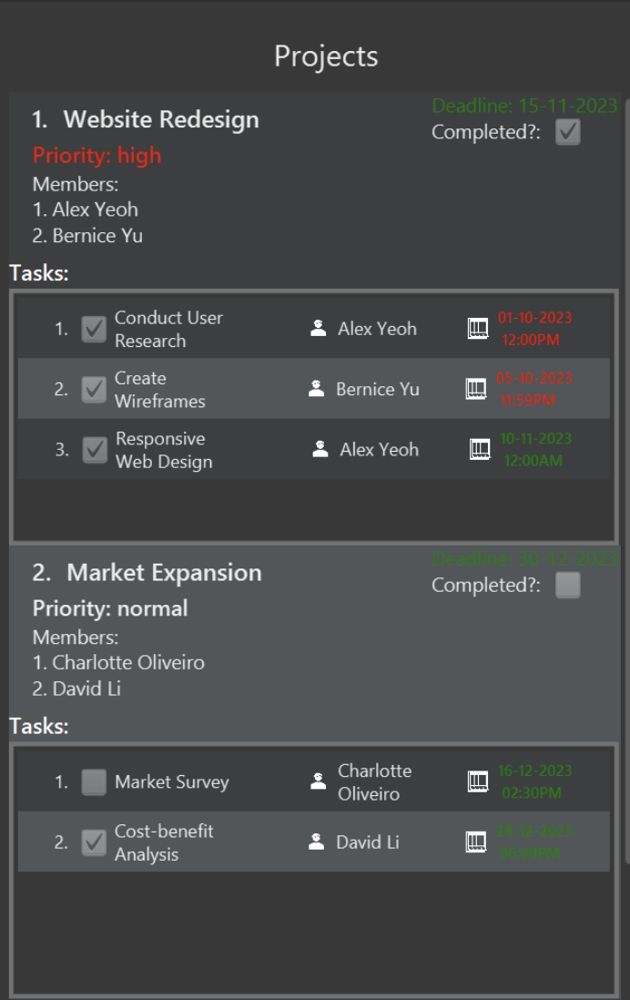
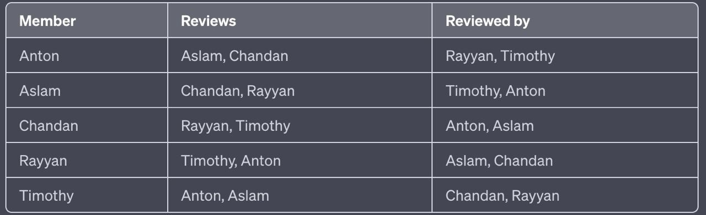

### Project: TaskHub

## Overview
TaskHub is a desktop project management application used by project managers to manage projects and their team members in each project. The user interacts with it using a CLI, and it has a GUI created with JavaFX. It is written in Java.
## Summary of Contributions

### Code Contributed:
My code contributions to TaskHub can be found [here](https://nus-cs2103-ay2324s1.github.io/tp-dashboard/?search=&sort=groupTitle&sortWithin=title&timeframe=commit&mergegroup=&groupSelect=groupByRepos&breakdown=true&checkedFileTypes=docs~functional-code~test-code&since=2023-09-22&tabOpen=true&tabType=authorship&tabAuthor=timleow&tabRepo=AY2324S1-CS2103T-T08-3%2Ftp%5Bmaster%5D&authorshipIsMergeGroup=false&authorshipFileTypes=docs~functional-code~test-code&authorshipIsBinaryFileTypeChecked=false&authorshipIsIgnoredFilesChecked=false%23%2F):

### Enhancements implemented:


- **Upgraded Help Window:**
  - Modified `Ui` for `HelpWindow.java`.
  - Displays a quick guide of all commands.
  - Provides a clickable hyperlink to the user guide at the bottom, instead of the original 'copy to clipboard' feature.
  - Added value to the `help` command.




- **`Task` Model, `addT`, and `deleteT` Command:**
  - Created infrastructure for tasks in both the `model` and `Ui` files - the Ui can be seen in the 'Tasks' section of the `Project`s in the screenshot above.
  - Implemented basic functionality for adding and deleting tasks.
  - Efficiently manages multiple task deletions.
  - Enhanced `addT` to allow task assignment to an employee upon creation using the optional `em/` parameter.


### Contributions to the UG:
- **Introductory section**
  - Getting Started
    - Installing and launching TaskHub
    - Understanding the components of TaskHub
    - Quick Start
- **Features section**
  - Explanation for `addT` command.
  - Explanation for `deleteT` command.

### Contributions to the DG:
- **Architecture, UI Component, Logic component, Model Component, Employee, Project, Task components**
  - Addition of tasks to the Class Diagram for Ui component 
  - Minor updates and diagram changes to other components (e.g., removing attributes section, updating command names/links)
- **Implementation Section**
  - Upgraded Help Feature
  - Add Task feature (created sequence diagram for this)
### Contributions to team-based tasks:
- Set up the GitHub team org/repo
- Updated diagrams in DG related to Tasks
- Created tags to help with bug triaging post PE-D
- Generated table for PR review allocations here:



### Review/mentoring contributions:
- Within the team, we had decided that each of us were to review 2 of our teammates. I mainly reviewed Anton and Aslam's PRs.
- Helped Anton with centering the TaskHub logo in [this PR ](https://github.com/AY2324S1-CS2103T-T08-3/tp/pull/167/files/9539b1872903d50de0d94125b550a784ac42b0cf), by providing a code block which gave advice on handling positioning of components on Java FXML.
- Gave Aslam code quality suggestions in [this PR](https://github.com/AY2324S1-CS2103T-T08-3/tp/pull/109) so that we could sync up our implementation of deadlines in both `Tasks` and `Projects`.

### Contributions beyond the project team:
#### Evidence of helping others e.g. responses you posted in our forum, bugs you reported in other team's products,
- Reported an above average bug count of 10 with value-added suggestions to my allocated PE-D team, can be seen from the [PE-D](https://github.com/timleow/ped/issues) repo.
  

#### Evidence of technical leadership e.g. sharing useful information in the forum
- Participated in the forum in this [issue](https://github.com/nus-cs2103-AY2324S1/forum/issues/145).
--- ---

### Contribution to developer guide (extracts)

---

### UI component

The **API** of this component is specified in [`Ui.java`](https://github.com/AY2324S1-CS2103T-T08-3/tp/blob/master/src/main/java/seedu/address/ui/Ui.java)


The UI consists of a `MainWindow` that is made up of parts e.g.`CommandBox`, `ResultDisplay`, `EmployeeListPanel`, `ProjectListPanel`, `StatusBarFooter` etc. All these, including the `MainWindow`, inherit from the abstract `UiPart` class which captures the commonalities between classes that represent parts of the visible GUI.

The `UI` component uses the JavaFx UI framework. The layout of these UI parts are defined in matching `.fxml` files that are in the `src/main/resources/view` folder. For example, the layout of the [`MainWindow`](https://github.com/AY2324S1-CS2103T-T08-3/tp/blob/master/src/main/java/seedu/address/ui/MainWindow.java) is specified in [`MainWindow.fxml`](https://github.com/AY2324S1-CS2103T-T08-3/tp/blob/master/src/main/resources/view/MainWindow.fxml)

The diagram above briefly demonstrates the hierarchy of the Ui components. A few more notes are as follows:
* At the level just below `MainWindow`, there are the main components, like `CommandBox`, `ResultDisplay`, `EmployeeListPanel` and `ProjectListPanel`.
* `EmployeeListPanel` contains some number of `EmployeeCard`s.
* `ProjectListPanel` contains some number of `ProjectCard`s
  * which contain a `TaskListPanel` with their `TaskCard`s if the relevant `Project` in the `Model` contains a `Task`.

The `UI` component,

* executes user commands using the `Logic` component.
* listens for changes to `Model` data so that the UI can be updated with the modified data.
* keeps a reference to the `Logic` component, because the `UI` relies on the `Logic` to execute commands.
* depends on some classes in the `Model` component, as it displays `Employee` object residing in the `Model`.


### Add Task feature


When creating a new task using the `addT` command, the `TaskList` of the specified `Project` is updated, and the `Project` is hence updated too.

Given below is an example usage scenario and the internal changes that happen at each step.

Step 1. The user launches the application. All employees and projects will be shown to the user.

Step 2. The user executes `addT n/todo pr/1 em/1 d/11-11-2023 2359` to add a new `Task` called `todo` to the first currently listed `Project`, assigned to the first `Employee` within that `Project`. `LogicManager` will call `TaskHubParser#parse(input)` to extract the parameters and pass it to an `AddTaskCommandParser`.

Step 3. `TaskHubParser` will call `AddTaskCommandParser#parse(arguments)` to produce a `AddTaskCommand` to be executed by the `LogicManager`.

Step 4. `LogicManager` calls `AddTaskCommand#execute(model)` to produce a `CommandResult `to be logged.

Step 5. During the execution of the `AddTaskCommand`, a new `Project` copy is created, with an updated `TaskList` that contains the newly created `Task`.
If an `employeeIndex` was specified by the command (in this case it was), then `Model::getFilteredEmployeeList` is called to assign the new `Task` to the specified  `Employee`.
Then, the `Model#setProject` and `Model#updateFilteredProjectList` is called, to trigger a `Ui` update, as the specified `Project` has been updated with an updated `TaskList`.

Step 6. A `CommandResult` is produced based on whether the execution was a success or not and returned to the `LogicManager`.

---

### Contribution to user guide (extracts)

--- 

# Getting Started

## Installing and Launching TaskHub

### Step 1: Install Java

Ensure you have Java `11` or above installed on your computer. If you don't have Java installed, follow the steps in [Appendix A: Installing Java](#appendix-a-installing-java).

### Step 2: Download TaskHub

Download the latest `taskhub.jar` from [here](https://github.com/AY2324S1-CS2103T-T08-3/tp/releases).

### Step 3: Set up TaskHub Home Folder

Copy or move the downloaded `taskhub.jar` file to the folder you want to use as the _home folder_ for your TaskHub.

### Step 4: Launch TaskHub

1. Open a terminal (MacOS) or command prompt (Windows).

2. Navigate to the folder where you placed the `taskhub.jar` file using the `cd` command. For example, our friendly TaskHubber has his `taskhub.jar` file in `/Users/timothyleow/Developer/TaskHub`, so he'll run:

    ```bash
    cd /Users/timothyleow/Developer/TaskHub
    ```

3. Verify that your working directory contains `taskhub.jar` by using the `ls` command. You should see `taskhub.jar` in the list of files printed. Here's what our friendly TaskHubber got when running this command.

    ```bash
    timothyleow@timleows-MBP TaskHub % ls
    taskhub.jar
    ```

4. Once your terminal's working directory is the folder that contains `taskhub.jar`, run the following command to launch TaskHub:

    ```bash 
    java -jar taskhub.jar
    ```

   After executing this command, a graphical user interface (GUI) similar to the one below should appear shortly:

   

   Note: The application comes with some sample data for your reference.

---

## Understanding the components of TaskHub

---
### Employees


An `Employee` is someone that you are managing. TaskHub allows you to store their essential details and `tag` them with their strengths and weaknesses so you can allocate them to suitable [`Projects`](#projects) or [`Tasks`](#tasks).

#### Attributes:

| Field        | Description                                                    | Prefix for [`addE`](#add-an-employee-adde) |
|--------------|----------------------------------------------------------------|--------------------------------------------|
| Name         | Name of the employee.                                          | `n/`                                       |
| Phone Number | Phone number of the employee.                                  | `p/`                                       |
| Email        | Email address of the employee.                                 | `e/`                                       |
| Address      | Address of the employee.                                       | `a/`                                       |
| Tags         | Tags indicating strengths/weaknesses/position of the employee. | `t/`                                       |

---

### Projects


A `Project` in TaskHub is a managerial unit that includes information about [`Employees`](#employee) allocated to the project and an (optionally) set [deadline](#edit-deadline-of-a-projects-dlp). You can [mark](#mark-projects-as-completed-markp) a `Project` as done when you deem fit. Additionally, you can add `Tasks` to a `Project`.
#### Attributes:

| Field            | Description                                                | Prefix for [`addP`](#add-a-new-project-addp) | Relevant Command(s)                                                                             |
|------------------|------------------------------------------------------------|----------------------------------------------|-------------------------------------------------------------------------------------------------|
| Name             | Name of the project.                                       | `n/`                                         | -                                                                                               |
| Employees        | Employees assigned to the project.                         | `em/`                                        | [`assignP`](#assign-employees-to-a-project-assignp)                                             |
| Deadline         | Deadline for the project.                                  | -                                            | [`dlP`](#edit-deadline-of-a-projects-dlp)                                                       |
| Priority         | Priority level of the project.                             | -                                            | [`priorityP`](#prioritise-projects-priorityp)                                                   |
| CompletionStatus | Indicates whether the project is completed or in progress. | -                                            | [`markP`](#mark-projects-as-completed-markp), [`unmarkP`](#mark-projects-as-incomplete-unmarkp) |
| Tasks            | Tasks associated with the project.                         | -                                            | [`addT`](#add-a-new-task-to-a-project-addt)                                                     |

---

### Tasks


A `Task` in TaskHub represents a specific job within a `Project` that can be assigned to an `Employee` under that `Project`. Tasks are required to have a deadline. Managing `Task`s will be the main way of monitoring the work done within your `TaskHub`!

#### Attributes:

| Field    | Description                            | Prefix for [`addT`](#add-a-new-task-to-a-project-addt) | Relevant Command                                                                          |
|----------|----------------------------------------|--------------------------------------------------------|-------------------------------------------------------------------------------------------|
| Name     | Name of the task.                      | `n/`                                                   | -                                                                                         |
| Employee | Employee assigned to the task.         | `em/`                                                  | [`assignT`](#assign-an-employee-to-a-task-assignt)                                        |
| Deadline | Deadline for completing the task.      | `d/`                                                   | -                                                                                         |
| isDone   | Indicates whether the task is complete.| N.A.                                                   | [`markT`](#mark-tasks-as-completed-markt), [`unmarkT`](#mark-tasks-as-incomplete-unmarkt) |


## Quick start

<div markdown="span" class="alert alert-warning">

**:warning: Warning:** The first step in the Quick Start guide involves `deleteP`, which is irreversible. If you wish to keep the sample data, then you can head straight to the [Features](#features) section below to figure out TaskHub on your own.

</div>

If you're okay with modifying the sample data, then we'll proceed with our first gist of project management with TaskHub. Time is ticking!

If you haven't started running any commands, TaskHub should look something like this when you first run it:


### Step 1: Deleting a finished project
Hmmm, it seems like you're done with the 'Website Redesign Project'. Let's get rid of this data by running the below command.

```
deleteP 1
```

You should get the following response:

```
Deleted Project: Name: Website Redesign; Completed? Yes; Deadline: 15-11-2023; Priority: HIGH
Members: Alex Yeoh, Bernice Yu
```
Now, you're looking at the 'Market Expansion' project, which we'll be focusing on.


### Step 2: Adding a new employee to TaskHub:
You've just got an email from your boss, saying that the fresh graduate that you recently interviewed is joining your team!

Here are his details:

| Name         | Anton Tan                       |
|--------------|---------------------------------|
| Phone Number | 98765432                        |
| Email        | anton@mail.com                  |
| Address      | Anton Street, block 123, #01-01 |
| Strengths    | TeamPlayer, Hardworking         |

Let's run the following command to add him to your team of [`Employees`](#employees).

```
addE n/Anton Tan p/98765432 e/anton@mail.com a/Anton Street, block 123, #01-01 t/TeamPlayer t/Hardworking
```

You should get the following response:
```
New employee added: Anton Tan; Phone: 98765432; Email: anton@mail.com; Address: Anton Street, block 123, #01-01; Tags: [TeamPlayer][Hardworking]
```

### Step 3: Assigning an Employee to a Project in TaskHub:
You've decided that you need more help with the 'Market Expansion Project'. Let's run the following command to enlist Anton's help:
```
assignP pr/1 em/7
```

You should get the following response:
```
Member(s) have been assigned!
Name: Market Expansion; Completed? No; Deadline: 30-12-2023; Priority: NORMAL
Members: Charlotte Oliveiro, David Li, Anton Tan
```

### Step 4: Adding a Task to a Project:
Anton is eager to contribute to his newly assigned project. Since you've found that he is particularly skilled at Market Segmentation, let's run the following command to give him a task that he will excel at. To measure his capabilities, you'll only give him until the end of November to complete this.
```
addT n/Market Segmentation pr/1 em/3 d/30-11-2023 2359
```

You should get the following response:
```
New task added to project 1, Description: Market Segmentation; Deadline: 30 Nov 2023, 11:59PM; Assignee: Anton Tan
```

### Step 5: Marking a Task as Complete:
It's the next morning. You receive an eager email from Anton reporting that he's already completed the Market Segmentation `Task`. After reviewing his report, you are thoroughly impressed and wish to mark his work as done in `TaskHub`. Let's run this command:
```
markT pr/1 t/3
```

You should get the following response:
```
1 task(s) marked as completed under the project: Market Expansion
```

If you've followed the steps correctly, TaskHub should look something like this now:

Scroll down in the `Employees` pane to notice Anton, the newest addition to your team.


For a more comprehensive overview of what you can achieve with TaskHub, you may proceed to the [Features](#features) section below.

